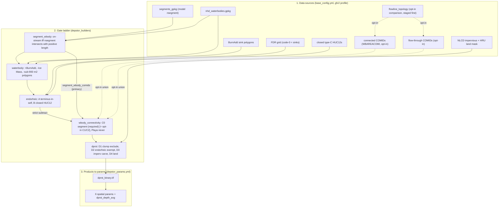

# Depression-Storage Classification — Reference

**What this is.** A single, current-state map of how the depression-storage
(dprst) workflow turns raw geospatial inputs into PRMS/NHM parameters, organized
around three questions:

1. **[Data sources](#1-data-sources)** — what goes in, and which config key names it.
2. **[The gate ladder](#2-the-gate-ladder)** — the ordered tests that decide whether a
   waterbody is depression storage or on-stream.
3. **[Products → parameters](#3-products--parameters)** — the rasters produced and how they
   become the six spatial PRMS parameters.

Plus a **[staleness / maintenance](#4-staleness--maintenance)** section (which gates are
load-bearing, which are dead, what is in motion) and a **[one-page map](#5-one-page-map)**.

Verified against `main` (post-PR #178 endorheic classifier + PR #179 waterbody
repoint + the segment-driven on-stream classifier that replaced C1/C2 below with
`segment_wbody`). Where a claim rests on code, it cites `file:function`; line
numbers drift, so function names are the durable reference. This supersedes the
historical planning transcription in [`depstor_workflow.md`](depstor_workflow.md)
(the original Bock/Russell design PDF) as the description of the *shipped*
pipeline.

> **How to read this if you're lost.** The classifier grew one gate at a time
> across a dozen PRs, each fixing a real bug the previous one exposed, and no
> single source file states the whole sequence. Section 2 is that sequence. If
> you only read one thing, read the [gate ladder](#2-the-gate-ladder).

---

## 0. Where everything is declared — the three config files

The pipeline is config-driven; almost nothing is hardcoded. Three files, each
with a distinct job:

| File | Declares | Read by |
|---|---|---|
| [`configs/base_config.yml`](../configs/base_config.yml) | **Per-fabric inputs.** One profile per fabric (`gfv2`, `gfv2_dev`, `oregon`, `tjc`, …) under `fabrics:`. Every source path, plus fabric identity keys (`id_feature`, `hru_gpkg`, floors). Resolved by `load_config()` via `--fabric` → `FABRIC` env → `default_fabric`. | every builder + script |
| [`configs/depstor/depstor_rasters.yml`](../configs/depstor/depstor_rasters.yml) | **The raster stack.** An ordered `steps:` list; each step names a builder and its output raster(s). This is the classification + routing DAG. | `scripts/build_depstor_rasters.py` |
| [`configs/depstor/depstor_params.yml`](../configs/depstor/depstor_params.yml) | **The zonal aggregation.** `fractions:` (per-HRU cell counts from a raster), `ratios:` (final PRMS params = numerator ÷ denominator fraction), and `means:` (continuous-raster means, e.g. depth). | `scripts/derive_depstor_params.py` |

Placeholders (`{data_root}`, `{fabric}`, `{vpu}`) resolve at load time.
`{data_root}` is `/caldera/hovenweep/projects/usgs/water/impd/nhgf/gfv2_param_v2`
([base_config.yml:10](../configs/base_config.yml#L10)).

**Fabric caveat that bites:** the source paths below are the **`gfv2`** profile.
Other fabrics differ in file paths, but as of the segment-driven classifier
work every CONUS fabric (`gfv2`, `gfv2_dev`, `oregon`, `tjc`) reads the
source-derived `nhd_waterbodies.gpkg` (PR #179 repointed `gfv2`; the others
followed) — the older hand-made `conus_waterbodies.gpkg` is retired, kept on
disk only for A/B reference. See [§4](#4-staleness--maintenance).

---

## 1. Data sources

Everything the classification consumes. Almost all of it is now **staged from
source** (NHDPlus V2 / WBD) by a module under `src/gfv2_params/download/`,
replacing an earlier set of hand-made files.

| Source | `gfv2` profile key | Resolves to | Staged by | Role |
|---|---|---|---|---|
| NHD waterbody polygons | `waterbody_gpkg` ([:49](../configs/base_config.yml#L49)) | `input/nhd/nhd_waterbodies.gpkg` | `download/nhd_waterbodies.py` | the base geometry every gate runs on |
| Model stream segments (`nsegment`) | `segments_gpkg`/`segments_layer` ([:40](../configs/base_config.yml#L40)) | `gfv2/fabric/gfv2_nsegment_merged.gpkg` | `scripts/merge_vpu_segments.py` | **the on-stream promoter** — a waterbody is on-stream iff a segment intersects it with positive length |
| Flowline topology (PlusFlowlineVAA) | *(no key — staged by path)* | `input/nhd/flowline_topology.parquet` | `download/nhd_topology.py` | **opt-in comparison only** — Network-membership truth for the two NHD tables below |
| WBAREACOMI connected COMIDs | `connected_comids_table` (commented out; [:58](../configs/base_config.yml#L58)) | `input/nhd/connected_waterbody_comids.parquet` | `download/nhd_flowlines.py` | **opt-in comparison promoter** — unioned into the segment set only if configured, logs `COMPARISON MODE` |
| Flow-through COMIDs | `flowthrough_comids_table` (commented out; [:59](../configs/base_config.yml#L59)) | `input/nhd/flowthrough_waterbody_comids.parquet` | `download/nhd_flowthrough.py` | **opt-in comparison promoter**, same as above |
| Closed (type-C) HUC12s | `wbd_huc12_table` | `input/wbd/wbd_huc12.parquet` | `download/wbd_huc12.py` | endorheic Signal B |
| BurnAddWaterbody sink polygons | `burn_add_waterbody_table` | `input/nhd/burn_add_waterbodies.parquet` | `download/nhd_burn_components.py` | adds playa/closed-lake depression **area** |
| FDR grid (code-0 = NHDPlus sinks) | `fdr_raster` ([:27](../configs/base_config.yml#L27)) | `gfv2/shared/gfv2_fdr.vrt` | `scripts/clip_shared_to_fabric.py` | endorheic Signal A **and** all D8 routing |
| NLCD fractional impervious | `imperv_source` (in `depstor_rasters.yml`) | NLCD annual impervious tif | external | the impervious carve |
| HRU fabric (land/domain mask) | `hru_gpkg` ([:90](../configs/base_config.yml#L90)) | `gfv2/fabric/…nhru…gpkg` | rasterized by the `landmask` step | the domain mask + the per-HRU denominator |
| On-stream COMID floor | `min_onstream_comids` (optional; gfv2/gfv2_dev 30000, oregon 500) | — | — | guards `segment_wbody`'s output at both the producing and consuming end |

**The on-stream promoter is now the model's own segment network, not NHD.**
`segment_wbody` runs before `waterbody` in `STEP_ORDER` and needs no separate
staging — it reads `segments_gpkg` and `waterbody_gpkg`, both already-required
profile inputs. `nhd_topology` → `nhd_flowlines`/`nhd_flowthrough` are retained
purely as an opt-in comparison union (commented out of every fabric profile);
their #161 Network-Flowline-membership ordering rule (`nhd_topology` must stage
first) still holds, but only matters on that comparison path — a normal depstor
run stages none of the three.

**Provenance-only, not a gate:** `sink_points_table`
([base_config.yml:79](../configs/base_config.yml#L79), →
`input/nhd/sink_points.parquet`) is threaded through the build context but read
by **no classifier** — the endorheic test reads the FDR grid the router reads,
not a sink-point vector. The profile comment and the `BuildContext` docstring
both say so explicitly. It is kept deliberately for provenance; do not wire it to
a gate.

---

## 2. The gate ladder

A waterbody passes through **five builder stages in fixed order**
([`depstor_rasters.yml`](../configs/depstor/depstor_rasters.yml) `steps:`;
dispatch order in `depstor_builders/__init__.py` `STEP_ORDER`):

```
segment_wbody  →  waterbody  →  endorheic  →  wbody_connectivity  →  dprst
```

Each stage's gates, in execution order. **Direction** = which way the gate pushes
a waterbody (→ dprst or → on-stream). **Kind** = hard override vs. weighed signal
vs. proxy.

### Stage 0 — `segment_wbody.build()` · which waterbodies are on the model's network

Runs first (ahead of `waterbody`, whose BurnAdd overlap guard consumes this
output). No raster inputs — cheap (42 s / 2.0 GB at CONUS).

| Gate | Test | Reads | Direction | Kind |
|---|---|---|---|---|
| **positive-length intersection** | a waterbody is on-stream iff a model `nsegment` intersects it with length > 0 (a zero-length shoreline graze does not count — 3.1% of candidate pairs CONUS-wide) | `segments_gpkg`, `waterbody_gpkg` | → on-stream | **the primary promoter** |
| **extent guard** | raise if the segment layer's extent doesn't overlap the template grid — catches a `segments_gpkg` mis-wired to another fabric before it silently promotes zero waterbodies | `segments_gpkg` vs `template_raster` | — | guard, `_assert_overlaps_template()` |
| **floor guard** | raise if the resulting COMID count is below `min_onstream_comids` (optional per-fabric) | COMID count | — | guard, `check_onstream_floor()` |

Emits `segment_waterbody_comids.parquet` (`comid`/`n_segments`/`overlap_m`,
registered key `segment_wbody_comids`) — the **required primary** on-stream
source for Stage 3 below, consumed pre-endorheic by `waterbody`'s BurnAdd
guard, and (minus endorheic) by `dprst_depth`.

### Stage 1 — `waterbody.build()` · what counts as a waterbody at all

| Gate | Test | Reads | Direction | Kind |
|---|---|---|---|---|
| **BurnAdd merge** | union NHDPlus BurnAddWaterbody sink polygons (playa / closed-lake depression *area*) into the layer; negative COMIDs, so they can never match a positive on-stream COMID; a clump-overlap guard raises if a BurnAdd clump transitively reaches an on-stream waterbody | `burn_add_waterbody_table` | adds dprst area | structural | `merge_burn_add()` |
| **Ice Mass exclude** | drop `FTYPE ∈ EXCLUDE_WATERBODY_FTYPES` (Ice Mass) from the layer **entirely** — it becomes land (perv/imperv via LULC), neither dprst nor on-stream | `FTYPE` | → land | **hard override** | `build()`, [waterbody.py:86](../src/gfv2_params/depstor_builders/waterbody.py#L86) |
| **min-area** | keep polygons ≥ `min_area_threshold` (900 m² — one 30 m cell; [depstor_rasters.yml:37](../configs/depstor/depstor_rasters.yml#L37)) | geometry | drops sub-900 m² polygons | threshold |
| *(rasterize)* | write `wbody_binary.tif`; label 8-connected clumps → `wbody_regions.tif` (`clump_regions`) | — | — | — |

### Stage 2 — `endorheic.build()` · is the basin closed? *(computes a COMID table; applied in Stage 3)*

Emits `endorheic_waterbody_comids.parquet` with **per-signal provenance columns**
(`by_terminus`, `by_closed_huc12`) so you can always tell which signal flagged a
lake.

| Signal | Test | Reads | Direction | Kind |
|---|---|---|---|---|
| **A — terminus inside itself** | for each waterbody containing ≥1 FDR **code-0** (terminal) cell, run the D8 kernel; flag if `frac_own > 0.5` — the share of the waterbody's *own* cells whose D8 path dead-ends at a terminus **inside the same polygon** | `fdr_raster` + the router's own D8 kernel | → dprst | weighed (`MIN_FRAC = 0.5`) | `terminus_own_fraction()`, [endorheic.py:281](../src/gfv2_params/endorheic.py#L281) |
| **B — closed HUC12** | flag if the waterbody sits **majority-area** (>0.5) inside the dissolved union of WBD type-C (closed) HUC12s — majority-area, never `intersects` (a boundary graze returns True) or `within` (drops GSL, which spills 1.1% out) | `wbd_huc12_table` (optional) | → dprst | weighed | `closed_basin_comids()` |
| *(floor guard)* | raise if the flagged total < `min_endorheic_comids`, or if either signal collapses to zero | signal counts | — | guard | `check_endorheic_floor()` |

> Signal A carries the closed-lake **area** (Great Salt Lake ends in itself,
> `frac_own = 1.000`). Signal B catches lakes with **no interior FDR sink** (Walker
> Lake, `frac_own = 0.000`). They are complementary, not redundant — see [§4](#4-staleness--maintenance).

### Stage 3 — `wbody_connectivity.build()` · on-stream = segment set, minus endorheic

| Gate | Test | Reads | Direction | Kind |
|---|---|---|---|---|
| **C0 — segment-derived (required)** | the on-stream COMID set from Stage 0 | `segment_wbody_comids` | → on-stream | **the primary promoter** |
| **C1 — WBAREACOMI connected** *(opt-in comparison)* | waterbody COMID is in the NHD artificial-path connected set — **Network-gated** (its flowline must be a Network Flowline) — unioned in ONLY if `connected_comids_table` is configured; logs `COMPARISON MODE` | `connected_comids_table` | → on-stream | opt-in promoter |
| **C2 — flow-through union** *(opt-in comparison)* | union in the geometric/topology on-stream set: a Network line flows *through* (in **and** out), or is a routed-network source/outflow — also **Network-gated** — same opt-in/`COMPARISON MODE` behaviour as C1 | `flowthrough_comids_table` | → on-stream | opt-in promoter |
| **C3 — endorheic subtraction** | `on_stream = (C0 ∪ C1 ∪ C2) − endorheic`. COMID-keyed; can only ever **remove**. With C1/C2 absent (the default), this is the ONLY thing that demotes a terminal lake the positive-length rule promoted (segment intersection has no inflow/outflow test) | `endorheic` COMID table | → dprst | strict subtraction |
| **C4 — NEVER_ONSTREAM guardrail** | drop `FTYPE ∈ {Playa, Ice Mass}` from the on-stream selection (Playa is force-dprst; Ice Mass is already gone) | `FTYPE` | → dprst / land | **hard override** |
| *(floor guard)* | raise if the segment-derived COMID count is below `min_onstream_comids` — re-checked here (not just in Stage 0) because `--from wbody_connectivity` skips Stage 0 and hydrates its table off disk unvalidated | `segment_wbody_comids` count | — | guard, `check_onstream_floor()` |
| *(side output)* | rasterize the **full** endorheic set (regardless of on-stream) → `endorheic_wbody.tif`, for the Stage-4 exemption | endorheic table | evidence for D2 | — |

Outputs: `connected_wbody.tif` (on-stream cells) and `endorheic_wbody.tif`. Two
`_assert_*` guards (`_assert_no_endorheic_repromotion`,
`_assert_endorheic_selection_is_comid_faithful`) protect the strict-subtraction
invariant against a future layer whose COMID keys diverge.

### Stage 4 — `dprst.build()` · the final depression-storage raster

| Gate | Test | Reads | Direction | Kind |
|---|---|---|---|---|
| **D1 — region-level on-stream exclusion** | exclude a **whole** 8-connected clump if **any** cell touches `connected_wbody` | `connected_wbody.tif`, `wbody_regions.tif` | → on-stream | **proxy** |
| **D2 — endorheic clump-veto exemption** | recover cells where `endorheic_wbody == 1 AND connected != 1 AND wbody_binary == 1` back to dprst — direct terminus evidence overrides the clump proxy, but only for the waterbody's *own* not-on-stream cells | `endorheic_wbody.tif`, `connected_wbody.tif`, `wbody_binary.tif` | → dprst | evidence overrides proxy |
| **D3 — impervious carve** | `dprst[imperv == 1] = nodata`, **per cell**, never whole-region | `imperv_binary.tif` | removes imperv | per-cell |
| **D4 — land mask** | `dprst[~land] = nodata` | `land_mask.tif` | drops ocean | mask |

> **Why D2 exists.** `clump_regions` 8-connects Great Salt Lake to a 49 km²
> SwampMarsh whose water drains *into* the lake — so the marsh is correctly
> on-stream, but D1's whole-region veto would drop all ~4.85M GSL cells with it.
> D2 lets direct hydrologic evidence (terminus-inside-itself) override the clump
> proxy, without re-opening the over-extension the proxy prevents elsewhere.

Outputs: `dprst_binary.tif` (the depression product) and `onstream_binary.tif`.

---

## 3. Products → parameters

### 3a. The raster stack ([`depstor_rasters.yml`](../configs/depstor/depstor_rasters.yml) `steps:`)

| Raster | Represents | Built by (step) |
|---|---|---|
| `land_mask.tif` | 1 = land; the domain mask **and** the per-HRU pixel denominator | `landmask` |
| `imperv_binary.tif` | 1 = NLCD impervious cell (>50%) | `imperv` |
| `segment_waterbody_comids.parquet` | COMIDs a model `nsegment` intersects with positive length — the primary on-stream source | `segment_wbody` |
| `wbody_binary.tif` / `wbody_regions.tif` | waterbody cells / their 8-connected clump labels | `waterbody` |
| `endorheic_waterbody_comids.parquet` | COMIDs flagged endorheic (Signal A/B, with provenance columns) | `endorheic` |
| `connected_wbody.tif` | on-stream waterbody cells (after endorheic subtraction) | `wbody_connectivity` |
| `endorheic_wbody.tif` | the full endorheic set, on-stream or not (D2 evidence mask) | `wbody_connectivity` |
| **`dprst_binary.tif`** | **depression-storage cells** — the product | `dprst` |
| `onstream_binary.tif` | on-stream surface-storage cells | `dprst` |
| `perv_binary.tif` | pervious land = land − imperv − dprst (disjoint) | `perv` |
| `hru_id.tif` / `vpu_id.tif` | per-cell HRU id / VPU code | `hru_id` / `vpu_id` |
| `dprst_depth.tif` | per-cell dprst mean depth, masked to `dprst_binary` (#173) | `dprst_depth` |
| `drains_to_dprst.tif` | cells whose D8 path reaches a depression; on-stream cells are barriers (HRU-agnostic) | `routing` |
| `drains_to_dprst_hru.tif` | the HRU id of the depression each draining cell reaches (labeled) | `routing_hru` |
| `drains_perv_binary.tif` / `drains_imperv_binary.tif` | land draining to a depression **in its own HRU** (`drains_to_dprst_hru == hru_id`) | `same_hru_drains` |
| `carea_map_t8_binary.tif` / `carea_map_t156_binary.tif` | pervious cells above the two TWI thresholds | `carea_map` |

### 3b. The six spatial parameters ([`depstor_params.yml`](../configs/depstor/depstor_params.yml))

Every parameter is a **per-HRU ratio of two zonal cell-counts** (gdptools
exactextract; a `count` is the partial-pixel-weighted sum for the 1-valued cells,
*not* itself a fraction — the ratio makes it one). `fractions:` declares the
counts; `ratios:` declares the divisions.

| PRMS parameter | = count of… | ÷ count of… | Clamp |
|---|---|---|---|
| `dprst_frac` | `dprst_binary` | `land_mask` (HRU total) | — |
| `hru_percent_imperv` | `imperv_binary` | `land_mask` (HRU total) | — |
| `sro_to_dprst_perv` | `drains_perv_binary` | `perv_binary` | — |
| `sro_to_dprst_imperv` | `drains_imperv_binary` | `imperv_binary` | — |
| `carea_max` | `carea_map_t8_binary` | `perv_binary` | ≤ 1 |
| `smidx_coef` | `carea_map_t156_binary` | `perv_binary` | ≤ 1 |

Plus **`dprst_depth_avg`** — a `means:` entry, not a ratio: an exactextract
**mean** over `dprst_depth.tif` (metres → inches; HRUs with zero dprst floored at
49 in). Because `dprst_depth.tif` is itself masked to `dprst_binary`, depth stays
consistent with `dprst_frac` by construction.

**The subtle one — the same-HRU restriction.** `sro_to_dprst_perv/imperv`'s
numerators are **not** a plain zonal weight. `same_hru_drains.build()` does a
raster-space per-cell test — `drains_to_dprst_hru == hru_id` — to build
`drains_perv_binary.tif` / `drains_imperv_binary.tif` **before** gdptools runs,
counting a cell only if it drains to a depression in its *own* HRU. This
reproduces the legacy ArcPy `Con(rSro == hru)`
([docs/0b_TB_depr_stor.py:214](0b_TB_depr_stor.py)). Note it reads the *labeled*
`drains_to_dprst_hru.tif`, not the binary `drains_to_dprst.tif`.

**Non-spatial constants** (`dprst_flow_coef`, `dprst_seep_rate_*`, `smidx_exp`,
`op_flow_thres = 1.0`, …) are not part of this raster→param chain; see
[`pywatershed_depression_storage_requirements.md`](pywatershed_depression_storage_requirements.md).

---

## 4. Staleness / maintenance

The classifier accreted gate-by-gate; this section says which gates still earn
their place, which are dead, and what is in motion. Counts below are from the
**staged tables as currently built** (data-root artifacts; they drift as the
product is rebuilt).

### Confirmed load-bearing — *proven with data*, despite looking redundant

- **C1 (WBAREACOMI) vs C2 (flow-through)** are **not** redundant *(historical
  measurement — both are now opt-in comparison sources, not production
  promoters; C0/`segment_wbody` is)*. Measured on the pre-segment-classifier
  tables: `connected − flowthrough` = **7,496 COMIDs** that flow-through
  misses (and `flowthrough − connected` = 35,500). Neither subsumes the other;
  keep both if you enable the comparison union. *(The code computes only
  flow-through's new contribution, never the reverse, so it can't tell you this
  itself — this is the `set(connected) − set(flowthrough)` diff on the two
  parquets.)*
- **Signal A vs Signal B** are complementary. Measured: Signal-A-only = 1,436,
  Signal-B-only = 16,588, both = 4,916. Signal B carries the *count*; Signal A
  carries the *area* (GSL). The per-signal provenance columns + per-signal floor
  guard let you re-verify this from the shipped table anytime.
- **Signal A vs source-lake promotion (D1 in flow-through)** push in opposite
  directions (demote closed lakes vs. promote headwater/source lakes) and cannot
  cancel.
- The **"inert-today" `_assert_*` guards** in `wbody_connectivity` /
  `waterbody` are data-conditional invariants (they fire only if a future layer's
  COMID keys diverge or a BurnAdd clump reaches on-stream), not dead code. Keep.

### Confirmed dead — safe to remove *(the cleanup in this PR)*

- **`imperv_regions`** in `dprst.build()`
  ([dprst.py:82](../src/gfv2_params/depstor_builders/dprst.py#L82)) — a
  CONUS-scale full-grid `regions_touching_mask` pass whose result is, by its own
  comment, *"kept only for logging."* Impervious exclusion is the per-cell carve
  (D3); this region set changes no outcome. A decision-inert full-grid pass at
  16.9-billion-cell scale for one INFO line.
- **`depstor_builders/streambuffer.py`** — the pre-connectivity on-stream signal,
  retired when `wbody_connectivity` replaced it (documented at
  [base_config.yml:37](../configs/base_config.yml#L37)). Not in `STEP_ORDER`, not
  imported anywhere.
- **`depstor_builders/intersect.py`** — superseded by `same_hru_drains`. Not in
  `STEP_ORDER`, not imported. *(Distinct from the live `depstor.intersect_binaries`
  function — same word, different module.)*

### Intentionally retained — *not* dead, despite zero classifier reads

- **`sink_points_table`** — provenance + BurnAdd linkage; the profile comment and
  `BuildContext` docstring both say "not a classifier." Leave it.
- **Diagnostic fraction CSVs** — `onstream_storage_frac` and `drains_to_dprst_frac`
  are declared in `depstor_params.yml` `fractions:` but referenced by no `ratios:`
  entry; they're QA outputs, not parameter inputs. Harmless.

### In motion — decisions, not defects

- **Waterbody layer is now uniform across fabrics.** `gfv2` was repointed at the
  source-derived `nhd_waterbodies.gpkg` first (PR #179); `gfv2_dev`, `oregon`,
  and `tjc` were migrated to it too as part of the segment-driven classifier
  work, so every CONUS fabric now reads the same source-derived layer. The
  retired hand-made `conus_waterbodies.gpkg` is A/B reference only — resolved,
  no longer "in motion."
- **Reproducibility gap.** `download/nhd_waterbodies.py` writes
  `nhd_waterbodies.parquet`, but the builders read `nhd_waterbodies.gpkg`, and **no
  script in the repo converts one to the other** — a manual `ogr2ogr`-type step in
  an otherwise fully-scripted staging chain. Worth closing.
- **Orphan hand-made files on the data root** (not in the repo, not deleted by this
  PR): `input/nhd/sink_cats.gpkg` (referenced nowhere), `input/nhd/closed_huc12.gpkg`
  and `input/nhd/NHD_sink_points.gpkg` (superseded; the config warns against using
  them). Safe to delete from the data root when convenient — done outside version
  control.

---

## 5. One-page map

Sources feed the five-stage gate ladder; the ladder's `dprst_binary.tif` (and the
sibling rasters) become the parameters. The endorheic classifier feeds the
connectivity stage as a **strict subtraction** — it can only ever move a
waterbody toward depression storage. The NHD flowline-topology sources (dashed)
are opt-in comparison inputs only, off the production path by default.



The raster-to-parameter arithmetic (each param is a per-HRU ratio of two zonal
counts; see [§3b](#3b-the-six-spatial-parameters-depstor_paramsyml)):

| numerator raster | ÷ denominator raster | → parameter |
|---|---|---|
| `dprst_binary` | `land_mask` | `dprst_frac` |
| `imperv_binary` | `land_mask` | `hru_percent_imperv` |
| `drains_perv_binary` | `perv_binary` | `sro_to_dprst_perv` *(same-HRU)* |
| `drains_imperv_binary` | `imperv_binary` | `sro_to_dprst_imperv` *(same-HRU)* |
| `carea_map_t8_binary` | `perv_binary` | `carea_max` *(clamp ≤ 1)* |
| `carea_map_t156_binary` | `perv_binary` | `smidx_coef` *(clamp ≤ 1)* |
| `dprst_depth.tif` (mean, masked to `dprst_binary`) | — | `dprst_depth_avg` |

---

*Maintenance: regenerate the measured counts in [§4](#4-staleness--maintenance)
from the staged parquets after any rebuild. If a gate's `file:function` cite goes
stale, the durable anchor is the function name, not the line.*
