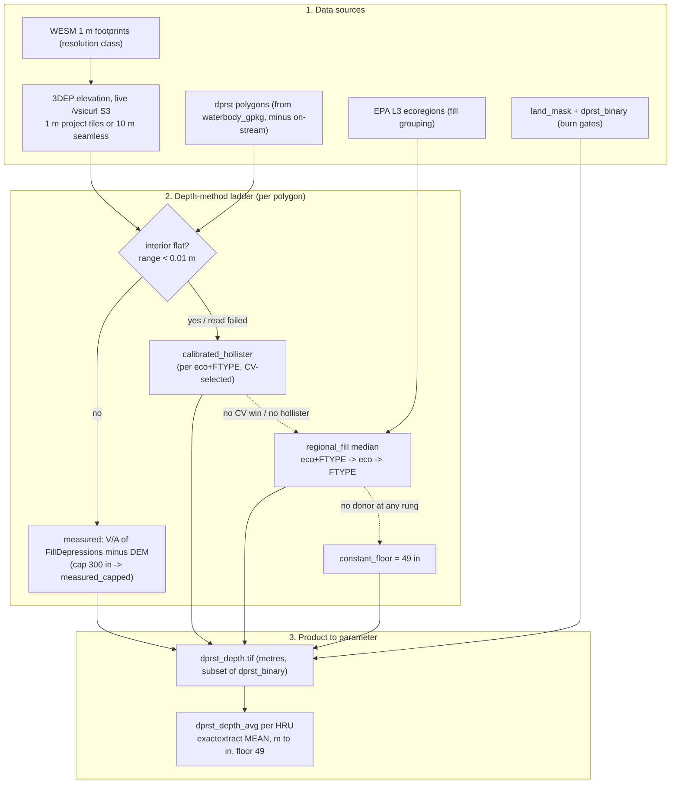

# `dprst_depth_avg` — Reference

**What this is.** A single, current-state map of how the depression-storage
**depth** parameter (`dprst_depth_avg`, issue #173) is produced, organized the
same three ways as its sibling
[`depstor_classification_reference.md`](depstor_classification_reference.md):

1. **[Data sources](#1-data-sources)** — what goes in, and which config key names it.
2. **[The depth-method ladder](#2-the-depth-method-ladder)** — how a single depth is chosen for
   each depression polygon, and the fallback hierarchy when it can't be measured.
3. **[Product → parameter](#3-product--parameter)** — how the depth raster becomes the per-HRU
   `dprst_depth_avg` CSV, plus how it runs at CONUS scale.

Plus **[staleness / maintenance](#4-staleness--maintenance)** and a **[one-page map](#5-one-page-map)**.

Verified against `main`. Code claims cite `file:function` (line numbers drift).
Where the classification reference decides *which waterbodies are depression
storage*, this decides *how deep each one is* — it runs **after** `dprst`
(it consumes `dprst_binary.tif`) and feeds one parameter, `dprst_depth_avg`.

> **The one thing to know first.** Unlike every other depstor input, the depth
> number is **not** read from a staged or local raster. It is pulled **live from
> 3DEP over the network** (`/vsicurl` to the public USGS S3 bucket), per polygon,
> at read time. That single fact drives most of the design below — the tiling,
> the resolution classes, and the failure modes.

---

## 0. Where it's declared — the same three config files

| File | Declares (for depth) | Read by |
|---|---|---|
| [`base_config.yml`](../configs/base_config.yml) | the `gfv2` profile keys the builder reads: `waterbody_gpkg`, `connected_comids_table`, `flowthrough_comids_table`, `hru_gpkg`, `wesm_index`, `ecoregions_gpkg`, `template_raster` | the builder |
| [`depstor/depstor_rasters.yml`](../configs/depstor/depstor_rasters.yml) | the `dprst_depth` **step** (`batch_dir`, outputs) + three top-level knobs: `dprst_depth_floor_in: 49.0` ([:25](../configs/depstor/depstor_rasters.yml#L25)), `dprst_hollister_n_min: 5` ([:26](../configs/depstor/depstor_rasters.yml#L26)), and `dprst_depth_min_measured_frac: 0.5` ([:27](../configs/depstor/depstor_rasters.yml#L27)) | `build_depstor_rasters.py` |
| [`depstor/depstor_params.yml`](../configs/depstor/depstor_params.yml) | the `means:` `dprst_depth_avg` entry — `source_raster` (`dprst_depth.tif`), `provenance_source` (`dprst_depth_polygons.parquet`), `floor_in: 49.0` ([:109](../configs/depstor/depstor_params.yml#L109)) | `derive_depstor_params.py` |

`dprst_depth_avg` is the pipeline's only **`means:`** parameter — a continuous
raster **mean**, not a `ratios:` numerator/denominator like the six spatial
params. That difference is the whole of [§3](#3-product--parameter).

---

## 1. Data sources

| Source | `gfv2` profile key | Resolves to | Read by | Role |
|---|---|---|---|---|
| **3DEP elevation (live)** | *(no key — hardcoded S3 URL templates)* | `/vsicurl` → `prd-tnm.s3.amazonaws.com` 1 m project tiles / 10 m seamless | `topo.read_window`, `topo.depth_to_spill` | **The depth itself.** Windowed to each polygon's bbox + 200 m rim, reprojected on read to EPSG:5070. |
| WESM 1 m footprint index | `wesm_index` | `input/wesm/wesm_1m_footprints.gpkg` | `topo.resolution_class`, `compute._project_lookup` | Decides each polygon's resolution class (1 m vs 10 m) and which 1 m project tiles cover it. |
| Waterbody polygons | `waterbody_gpkg` / `waterbody_layer` | `input/nhd/nhd_waterbodies.gpkg` | `topo.load_fabric_dprst_polygons` | The polygon universe; the dprst set is rebuilt from it (drop on-stream, force Playa, exclude Ice Mass). The geometry each depth is measured on. |
| Connected + flow-through COMIDs | `connected_comids_table`, `flowthrough_comids_table` | the two on-stream COMID parquets | same | Union → which waterbodies are on-stream (excluded from the depth set), matching the classifier. |
| Ecoregions (EPA L3) | `ecoregions_gpkg` | `input/ecoregions/us_eco_l3.gpkg` | `epa_ecoregions.ecoregion_of` | Tags each polygon's ecoregion — the grouping key for the regional fill. |
| HRU fabric | `hru_gpkg` / `hru_layer` | `gfv2/fabric/…nhru…gpkg` | `topo._clip_dprst_to_fabric`, `_write_op_flow_thres` | Clips the CONUS dprst set to the fabric; supplies HRU ids for `op_flow_thres`. |
| Template grid | `template_raster` | `gfv2/shared/gfv2_fdr.vrt` | `burn.burn_depth` | **Grid geometry only** — the lattice the depth is burned onto. Not an elevation source. |
| Land mask + dprst mask | `landmask` / `dprst` step outputs | `land_mask.tif`, `dprst_binary.tif` | `burn.burn_depth` | The two burn gates: `dprst_depth.tif` is a strict cell-subset of `land_mask ∩ dprst_binary`. |

### The elevation provenance — the crux

A depth physically comes from one of two 3DEP products, chosen per polygon:

- **1 m project tiles** if the polygon's **centroid falls inside a WESM 1 m
  footprint** (`topo.resolution_class`), *and* a 1 m tile actually covers the
  window. If no covering 1 m tile is found, it **silently falls back to 10 m**.
- **10 m seamless (1/3 arc-second)** otherwise.

There is **no staged DEM and no elevation config key** — all elevation is live
`/vsicurl` S3. Consequences the doc calls out under [§4](#4-staleness--maintenance):
a network/firewall regression no longer produces a silently **mass-floored**
product — `_fill_and_join` **raises `RuntimeError`** when under
`dprst_depth_min_measured_frac` (default 0.5, `depstor_rasters.yml`) of
polygons get a measured depth. Set the knob to `0` to disable (escape hatch
for a legitimately high-flattening small fabric).

---

## 2. The depth-method ladder

Every dprst polygon gets exactly one depth and one `method` provenance label.
The pivot is a **hydro-flattening test**: 3DEP flattens the interior of
essentially every lake ≥ ~2 acres to a constant breakline-enforced surface, so a
"measured" depth is only possible where the interior is *not* flat. Everything
else drops into a fill hierarchy.

**The flatness test** (`topo.is_hydroflattened`): a polygon's interior is *flat*
iff its **interior-only** DEM elevation range is `< 0.01 m`. Run on interior
cells only (never the rim). Flat → defer to the fill ladder.

**The "needs fill" set** = flat **OR** (not-flat but the measured depth came back
NaN/≤0, e.g. a DEM read failure). A read failure routes through the *same* donor
ladder, not straight to the floor.

The ladder, in priority order (`compute.py` produces rungs 1–2; `fill.py`
resolves 3–7):

| # | `method` label | What it computes | Selected when | file:function |
|---|---|---|---|---|
| 1 | **`measured`** | volume/area mean of `depth_to_spill` = `richdem.FillDepressions(DEM) − DEM` over the interior | interior not flat, valid cells | `compute._polygon_depth_from_dem` |
| 2 | **`measured_capped`** | rung 1, clamped to `DEPTH_CAP_M` = 300 in (7.62 m) | a measured depth > 300 in (DEM-fill artifact / valley pour-point) | `fill.fill_flat` |
| 3 | **`calibrated_hollister`** | `shape_factor(⅓) · k · hollister_max_m` — a terrain-slope max-depth scaled to a mean by a CV-fit slope `k` | the polygon needs fill **and** its own `(ecoregion, FTYPE)` group's calibrated model *won a K-fold CV comparison against the plain median* **and** the polygon has a finite `hollister_max_m` | `fill.Model.predict`, `fill._group_model` |
| 4 | **`regional_fill`** (rung 1) | median measured depth of its `(ecoregion, FTYPE)` group | needs fill; group model exists but is a median (or the calibrated model fell back) | `fill.fill_flat` |
| 5 | **`regional_fill`** (rung 2) | ecoregion-only median (all FTYPEs pooled) | the `(eco, FTYPE)` key is absent | `fill.fill_flat` |
| 6 | **`regional_fill`** (rung 3) | FTYPE-only median (all ecoregions pooled) | rungs 1–2 absent | `fill.fill_flat` |
| 7 | **`constant_floor`** | 49 in floor | no donor at any rung (no measured lake in its ecoregion, none of its FTYPE anywhere) | `fill.fill_flat` |

Then `burn.burn_depth` rasterizes the settled per-polygon depth onto
`dprst_depth.tif`, under the hard `⊆ dprst_binary` gate.

> **What the code actually does vs. the folklore.** The usual flat-lake fill is
> the **regional median** (`regional_fill`), *not* Hollister. `calibrated_hollister`
> is selected **per group, only when cross-validation proves it generalizes** —
> on the CONUS run it won ~1,900 HRUs, not the majority. The `constant_floor` is
> the last rung, not the primary flat-fill. And there is **no depth–area
> regression** anywhere in the code — it was evaluated in the #173 spike, found
> unusable (R²≈0), and never built; the only trace is a docstring explaining why.

`hollister_max_m` is computed for **every** polygon (flat or not) — it is both the
calibration training signal (from non-flat donors) and the predictor the
`calibrated_hollister` rung reads (for flat rows).

### The Hollister max-depth model, in detail

The `calibrated_hollister` rung rests on a terrain-morphometry estimate of lake
depth from the surrounding topography — the approach of Hollister et al. and its
`lakeMorpho` implementation. Three steps:

1. **Max depth from shoreline slope** (`topo.lake_max_depth`). Take the mean
   terrain slope in a 2-cell ring *just outside* the polygon (the shoreline) and
   project it inward to the lake's **point of maximum distance-to-shore**:
   `hollister_max_m = mean_shoreline_slope × max_distance_to_shore`. The intuition:
   a lake set into steep terrain is deep, one in flat terrain is shallow, and its
   deepest point sits farthest from any shore. (Void/nodata cells are neutralised
   first — a real elevation dropping to the −9999 sentinel across one pixel would
   otherwise yield an absurd gradient and an absurd max; issue #173 T6.)

2. **Max → mean** (`topo.max_to_mean`). `dprst_depth_avg` is a *mean* (V/A), so the
   max is scaled down by a basin shape factor. The code assumes a **conical** basin:
   `mean = max / 3` (the ⅓ shape factor). (`paraboloid` = ½ and `cylinder` = 1 exist
   in the helper but are unused.)

3. **Per-group calibration** (`fill._group_model`). Raw Hollister max-depth is a
   weak *absolute* predictor — the module docstring records **R² ≈ 0.17** — so it
   is never used raw. Instead, for each `(ecoregion, FTYPE)` group with enough
   measured donors, a single slope `k` is fit by least squares **through the
   origin** on `x = hollister_max_m`, `y = measured mean depth`, giving
   `mean = shape_factor · k · hollister_max_m`. `k` absorbs whatever the raw
   cone-Hollister estimate gets wrong for that group (`k = 1` would mean it is
   already unbiased). The calibrated model is used **only if it beats the group's
   plain median** in a paired K-fold cross-validation (lower CV RMSE); otherwise
   the group falls back to the median (`regional_fill`). That gate is why
   `calibrated_hollister` wins only ~1,900 HRUs — it must earn each group.

**References.** J.W. Hollister, W.B. Milstead & M.A. Urrutia (2011), "Predicting
maximum lake depth from surrounding topography," *PLoS ONE* 6(9): e25764 — the
method; and the `lakeMorpho` R package (Hollister & Stachelek 2017,
*F1000Research* 6:1718), whose `lakeMaxDepth` this mirrors. The #173 Phase-0 spike
([`dprst_depth_spike.md`](dprst_depth_spike.md)) records the local evaluation
behind the raw-vs-calibrated decision.

---

## 3. Product → parameter

### 3a. Outputs

| Artifact | Represents | Written by |
|---|---|---|
| **`dprst_depth.tif`** | float32 **metres**; each dprst cell carries its polygon's V/A mean depth; masked to `land_mask ∩ dprst_binary` | `burn.burn_depth` (row-strip streamed) |
| **`dprst_depth_polygons.parquet`** | per-polygon provenance: `COMID, method, dprst_depth_m` + diagnostics (`resolution, ftype, ecoregion, measured_max_m, hollister_max_m`) + geometry | `dprst_depth._write_polygon_provenance` |
| `op_flow_thres_params.csv` | per-HRU CSV, **constant 1.0** for every HRU (legacy parity, `docs/0b_TB_depr_stor.py:994`) — a byproduct, not a DAG dependency | `dprst_depth._write_op_flow_thres` |
| `dprst_depth_batches/` | the SLURM-array per-tile-batch parquets + a `_plan/` work-list (the CONUS fan-out) | array tasks + `tiling._plan` |

### 3b. `dprst_depth.tif` → `dprst_depth_avg`

Driven by `derive_depstor_params.py` in **two modes** (a separate DAG from the
binary params, chained by `slurm_batch/submit_dprst_depth.sh`):

1. **`mean_zonal`** — per-HRU-batch exactextract **continuous mean** of
   `dprst_depth.tif` (metres). Not categorical, not a count.
2. **`mean_finalize`** — concat the batch CSVs, then `aggregate.finalize_depth_params`:
   - **metres → inches** (`M_TO_IN = 39.3701`);
   - an HRU with **zero dprst cells** (NaN mean) gets the constant **`floor_in`
     = 49 in** — the result is never NaN, always > 0;
   - a 300-in cap backstop;
   - **provenance join:** `aggregate.area_weighted_provenance` overlays the
     polygon parquet on the HRU fabric and takes the **area-weighted majority
     `method`** per HRU → `dprst_depth_provenance`. Zero-dprst HRUs →
     `NO_DPRST_CELLS`.
   - Writes straight to `merged/nhm_dprst_depth_avg_params.csv` — **no ratio step.**

**Why a mean is exact:** `burn_depth` writes each polygon's own V/A onto all its
cells, so the area-weighted mean over an HRU's dprst cells collapses to that
HRU's aggregate ΣV/ΣA. (Contrast the six spatial params, which are
count/count **ratios**.)

### 3c. CONUS execution

The **unit of work is the elevation tile, not the polygon.** CONUS has ~286k
dprst polygons; reading a 3DEP raster once per polygon is too slow, so
`tiling.group_by_tile` maps each covering ~10 km tile to the polygons that need
it, and `tiling._plan` bin-packs tiles into a fixed SLURM array (default 150
batches):

- Packing is **cost-weighted by estimated window-read cells** (a few giant-lake
  windows dominate wall-clock and OOM'd under naive count-packing), via greedy
  LPT over **connected components** of tiles (so a polygon straddling a tile
  boundary is never split across batches and double-computed).
- A **giant-window guard** downgrades any 1 m polygon whose window exceeds
  `MAX_1M_WINDOW_CELLS` (200 M cells, ~14 km/side) to 10 m — a mean depth doesn't
  need 1 m detail.
- Budget: ~**250–500 core-hours** at CONUS scale, ~**5 h** wall-clock, ~**4 GiB**
  per window (float32 DEM + richdem float64 fill copies). The prairie-pothole
  belt is the largest component and the load-balance long pole. The single
  `--mem`/`--time` values live in `submit_dprst_depth.sh`.

---

## 4. Staleness / maintenance

### Looks removable — but load-bearing (don't delete)

Each of these reads like dead code at a glance; each is actually live or
by-design. Recorded so a future cleanup doesn't remove them by mistake.

- **`tile_batches`** (`tiling.py`) — looks like a lone, heavily-tested primitive
  with no production caller, but `component_tile_batches` (the production packer)
  calls it internally (`tiling.py`, in `component_tile_batches`) to pack each
  connected component's tiles. It is the inner bin-packing step, not a
  test-only relic. **Removing it breaks the production plan.**
- **The `DEPTH_CAP` over-cap clamp in `finalize_depth_params`** — looks
  unreachable, since per-polygon capping in `fill.fill_flat` already bounds every
  depth. But it still fires on **float32 rounding noise just past the cap** (e.g.
  `300.001`; `aggregate.py` FIX 5), and is a deliberate backstop against a future
  upstream that burns an uncapped polygon set. Live and purposeful.
- **`flat_pending`** — a method label `compute.py` stamps that `fill.fill_flat`
  overwrites before the *final* provenance parquet, so it is absent there (zero
  hits is expected). It is **not** absent from the persisted per-batch parquets,
  where it correctly marks "flat, awaiting its fill method." By-design
  intermediate state, not dead.
- **No depth–area regression exists.** Evaluated in the #173 spike, found
  unusable, never built — the only trace is a `fill.py` docstring explaining the
  decision. Nothing to remove; don't go looking for it.

### Operational risks — *not* defects, but worth guarding

- **`op_flow_thres` is a placeholder constant (1.0), not a derived product.** It
  is a per-HRU CSV in shape only, matching legacy ArcPy. No spatial computation
  stands behind it; nothing in the depstor DAG consumes it.

### Resolved / tracked

- **Stale docstrings naming the retired waterbody layer — fixed (PR #183).**
  `dprst_depth.py` and `topo.py` docstrings had named `conus_waterbodies.gpkg`;
  they now reference the profile's `waterbody_gpkg` layer, so they stay correct
  across the #179 repoint and across fabrics.
- **Silent mass-floor on network failure — fixed (robustness guards).** Because
  elevation is live `/vsicurl` S3, a firewall/S3 outage used to only **warn**
  (never abort) when < 50% of polygons got a measured depth, silently shipping a
  product where everything is the 49-in floor — numerically valid, physically
  meaningless. This is the same class of failure as the PROJ-network firewall
  issue already in the project's memory. `_fill_and_join` now **raises
  `RuntimeError`** below `dprst_depth_min_measured_frac` (default 0.5; `0`
  disables it as an escape hatch). A CONUS run should still be sanity-checked
  against the `method` distribution in `dprst_depth_polygons.parquet` (expect
  `measured` to dominate).
- **Provenance silently degrading to `unknown` — fixed (robustness guards).**
  If `dprst_depth_polygons.parquet` (a *configured* `provenance_source`) is
  missing at finalize time, `run_mean_finalize` now **raises
  `FileNotFoundError`** instead of warning and silently marking every HRU's
  `dprst_depth_provenance` as `unknown` — a declared-but-missing
  `provenance_source` means the builder run is incomplete/broken. Unconfigured
  `provenance_source` (not this parameter's case) is unaffected: provenance
  stays simply absent, no raise.

---

## 5. One-page map

The pivot is the per-polygon **flatness test**: a non-flat interior yields a
*measured* depth off live 3DEP; a flat (or read-failed) polygon drops into the
regional-fill ladder. Every polygon's depth is burned to `dprst_depth.tif`, whose
per-HRU **mean** (not a ratio) is `dprst_depth_avg`.

*Maintenance: after any CONUS run, sanity-check the `method` distribution in
`dprst_depth_polygons.parquet` — a spike in `constant_floor`/`regional_fill`
means the live 3DEP reads failed, not that the terrain changed. Durable code
anchor is the function name, not the line.*
