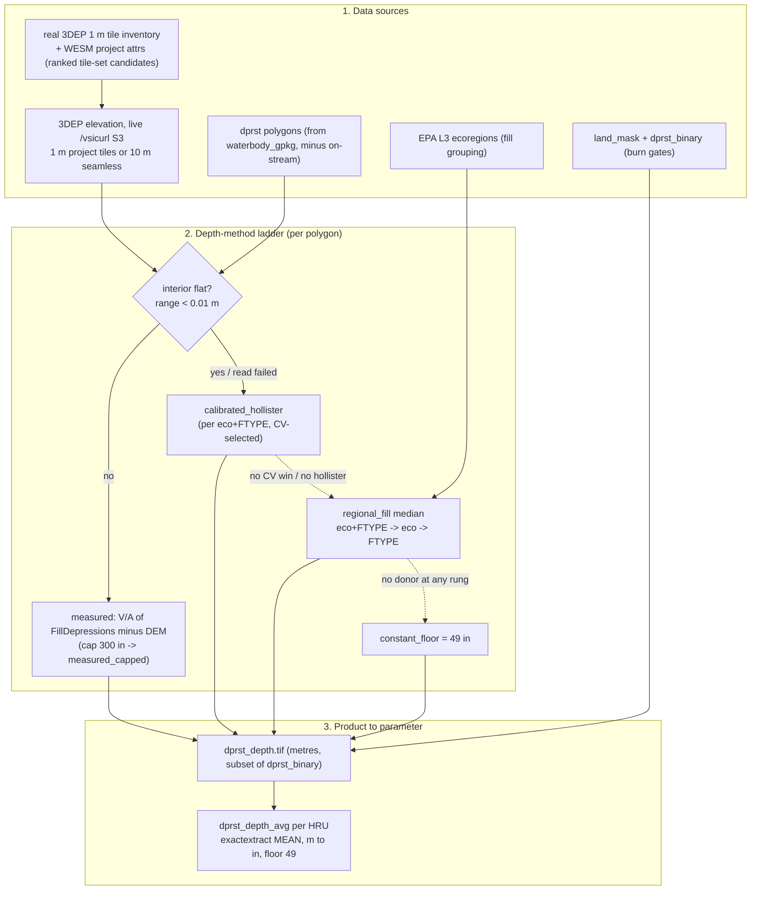

# `dprst_depth_avg` — Reference

**What this is.** A single, current-state map of how the depression-storage
**depth** parameter (`dprst_depth_avg`, issue #173) is produced, organized the
same three ways as its sibling
[`depstor_classification_reference.md`](depstor_classification_reference.md):

1. **[Data sources](#1-data-sources)** — what goes in, and which config key names it.
2. **[The depth-method ladder](#2-the-depth-method-ladder)** — how a single depth is chosen for
   each depression polygon, and the fallback hierarchy when it can't be measured.
3. **[Product → parameter](#3-product--parameter)** — how the depth raster becomes the per-HRU
   `dprst_depth_avg` CSV, plus how it runs at CONUS scale.

Plus **[staleness / maintenance](#4-staleness--maintenance)** and a **[one-page map](#5-one-page-map)**.

Verified against `main`. Code claims cite `file:function` (line numbers drift).
Where the classification reference decides *which waterbodies are depression
storage*, this decides *how deep each one is* — it runs **after** `dprst`
(it consumes `dprst_binary.tif`) and feeds one parameter, `dprst_depth_avg`.

> **The one thing to know first.** Unlike every other depstor input, the depth
> number is **not** read from a staged or local raster. It is pulled **live from
> 3DEP over the network** (`/vsicurl` to the public USGS S3 bucket), per polygon,
> at read time. That single fact drives most of the design below — the tiling,
> the resolution classes, and the failure modes.

---

## 0. Where it's declared — the same three config files

| File | Declares (for depth) | Read by |
|---|---|---|
| [`base_config.yml`](../configs/base_config.yml) | the `gfv2` profile keys the builder reads: `waterbody_gpkg`, `segments_gpkg`/`segments_layer` (via `segment_wbody_comids`), `hru_gpkg`, `dem_1m_inventory`, `wesm_project_attrs`, `ecoregions_gpkg`, `template_raster` | the builder |
| [`depstor/depstor_rasters.yml`](../configs/depstor/depstor_rasters.yml) | the `dprst_depth` **step** (`batch_dir`, outputs) + three top-level knobs: `dprst_depth_floor_in: 49.0` ([:25](../configs/depstor/depstor_rasters.yml#L25)), `dprst_hollister_n_min: 5` ([:26](../configs/depstor/depstor_rasters.yml#L26)), and `dprst_depth_min_measured_frac: 0.5` ([:27](../configs/depstor/depstor_rasters.yml#L27)) | `build_depstor_rasters.py` |
| [`depstor/depstor_params.yml`](../configs/depstor/depstor_params.yml) | the `means:` `dprst_depth_avg` entry — `source_raster` (`dprst_depth.tif`), `provenance_source` (`dprst_depth_polygons.parquet`), `floor_in: 49.0` ([:109](../configs/depstor/depstor_params.yml#L109)) | `derive_depstor_params.py` |

`dprst_depth_avg` is the pipeline's only **`means:`** parameter — a continuous
raster **mean**, not a `ratios:` numerator/denominator like the six spatial
params. That difference is the whole of [§3](#3-product--parameter).

---

## 1. Data sources

| Source | `gfv2` profile key | Resolves to | Read by | Role |
|---|---|---|---|---|
| **3DEP elevation (live)** | *(no key — hardcoded S3 URL templates)* | `/vsicurl` → `prd-tnm.s3.amazonaws.com` 1 m project tiles / 10 m seamless | `topo.read_window`, `topo.depth_to_spill` | **The depth itself.** Windowed to each polygon's bbox + 200 m rim, reprojected on read to EPSG:5070. |
| Real 3DEP 1 m tile inventory | `dem_1m_inventory` | `input/3dep/dem_1m_tile_inventory.parquet` | `sources.tag_and_assign`/`sources.rank_candidates` | Every published 1 m tile with its real, possibly-cropped, per-tile extent (read from each tile's own COG header). Decides each polygon's `best_topo` (1 m vs 10 m) and its ranked candidate tile SETS — replaces the retired convex-hull `wesm_index`, which invented coverage a project never flew. |
| WESM project attributes | `wesm_project_attrs` | `input/wesm/wesm_project_attrs.parquet` | `sources.rank_candidates` | WESM read **geometry-free** — quality (`ql`) and collection date (`collect_end`) per project, used only to break ties among real covering tile sets. Never a footprint/geometry source any more. |
| Waterbody polygons | `waterbody_gpkg` / `waterbody_layer` | `input/nhd/nhd_waterbodies.gpkg` | `topo.load_fabric_dprst_polygons` | The polygon universe; the dprst set is rebuilt from it (drop on-stream, force Playa, exclude Ice Mass). The geometry each depth is measured on. |
| On-stream COMIDs | `segment_wbody_comids` (from the `segment_wbody` step) minus `endorheic_comids` (from `endorheic`) | `segment_waterbody_comids.parquet` − `endorheic_waterbody_comids.parquet` | `topo.load_fabric_dprst_polygons(onstream_comids=...)`, both the in-process `build()` path and the SLURM `--plan` path (`tiling.py`) | Which waterbodies are on-stream (excluded from the depth set) — the SAME on-stream definition `dprst_binary.tif` uses, so the depth polygon set no longer diverges from the dprst raster (a ~769-waterbody divergence measured on `oregon` before this fix). `connected_comids_table`/`flowthrough_comids_table` are no longer read here; they're the classifier's opt-in NHD comparison inputs (see `depstor_classification_reference.md`), not part of `dprst_depth`'s input set at all. |
| Ecoregions (EPA L3) | `ecoregions_gpkg` | `input/ecoregions/us_eco_l3.gpkg` | `epa_ecoregions.ecoregion_of` | Tags each polygon's ecoregion — the grouping key for the regional fill. |
| HRU fabric | `hru_gpkg` / `hru_layer` | `gfv2/fabric/…nhru…gpkg` | `topo._clip_dprst_to_fabric`, `_write_op_flow_thres` | Clips the CONUS dprst set to the fabric; supplies HRU ids for `op_flow_thres`. |
| Template grid | `template_raster` | `gfv2/shared/gfv2_fdr.vrt` | `burn.burn_depth` | **Grid geometry only** — the lattice the depth is burned onto. Not an elevation source. |
| Land mask + dprst mask | `landmask` / `dprst` step outputs | `land_mask.tif`, `dprst_binary.tif` | `burn.burn_depth` | The two burn gates: `dprst_depth.tif` is a strict cell-subset of `land_mask ∩ dprst_binary`. |

### The elevation provenance — the crux

A depth physically comes from one of two 3DEP products, chosen per polygon by
`sources.tag_and_assign` against the **real, staged tile inventory** (issue
#223 part 2 — the old `topo.resolution_class`/WESM-hull path is retired from
production; it stays only as a Phase-0 audit function):

- **1 m project tiles**, ranked candidate tile SETS (one project, one UTM
  zone) that intersect the polygon's rim-buffered window, ordered by (covers
  the whole window, best quality level, newest collection date, project
  name). The primary (highest-ranked) set is what `compute.run_batch` reads
  first; if its interior genuinely yields no valid cells, or the read fails
  for a PERMANENT reason (404/403, an unreadable object, a heterogeneous
  `BuildVRT` mosaic -- `open_tile_set` builds with `strict=True` specifically
  so a heterogeneous/unopenable source is fatal rather than silently
  mosaicking a partial set of keys, which is GDAL's own default), it walks
  the remaining ranked candidates rather than falling back immediately. A
  **TRANSIENT** failure (DNS, connect, timeout, connection reset, HTTP
  0/408/429/5xx) is a different path entirely: it is retried on the SAME set
  with backoff+jitter (~2 minutes of backoff sleep, for a FAST-FAILING error
  -- a HANG-type one, e.g. a trickling connection, still pays GDAL's own
  per-request timeouts on top of that and can run to tens of minutes, see
  below), and if it outlasts that budget, it
  gets ONE deferred retry after a pause before the whole batch task fails
  loudly -- a transient network blip is not evidence the primary set is
  unusable, and the in-place budget alone can be shorter than the real
  outage (see `compute._classify_error_chain`, which classifies an
  exception's whole cause chain, not just its own message, into
  transient/permanent/unknown; two measured
  incidents: a one-second cluster-wide DNS failure on 2026-09-20 that
  silently demoted 87% of a smoke rerun's polygons off their correctly-
  ranked primary before this fix existed, and a second run whose ~30s DNS
  outage briefly outlasted the original ~20s in-place budget alone).
- **10 m seamless (1/3 arc-second)** — always appended as the LAST candidate,
  read only if every real 1 m candidate PERMANENTLY failed (never reached
  by a still-retrying, deferred, or ultimately-fatal transient failure).

This replaces a convex-HULL footprint test that invented coverage: measured
on the gfv2r2 CONUS run, 51.6% of polygons took the old per-polygon
existence-probe fallback, 67.8% of those only because two or more project
hulls overlapped one tile cell, and a probe of 300 such polygons found 61%
had exactly ONE real covering tile, 15% had NONE, and only 24% genuinely had
2+. The real inventory (every published tile's own COG-header extent) makes
the ranking reflect what actually exists, not hull overlap.

There is **no staged DEM and no elevation config key** — all elevation is live
`/vsicurl` S3; only the tile *inventory* (existence + extent) is staged.
Consequences the doc calls out under [§4](#4-staleness--maintenance):
a network/firewall regression no longer produces a silently **mass-floored**
product — `_fill_and_join` **raises `RuntimeError`** when under
`dprst_depth_min_measured_frac` (default 0.5, `depstor_rasters.yml`) of
polygons get a measured depth. Set the knob to `0` to disable (escape hatch
for a legitimately high-flattening small fabric).

**Windowed reads near a tile's edge.** Because the DEM comes from a live tile
rather than a CONUS-wide mosaic, the 200 m rim buffer around a polygon's bbox
routinely pokes past the edge of whichever 1 m or 10 m tile is backing the
read. Until #223, a rim that overhung a tile's left or top edge came back
*silently* shifted from where it was requested — no error, just the wrong
ground under the DEM array — which corrupted the depression fill and biased
the depth for polygons sitting near a tile boundary; a rim that fell entirely
off the tile came back empty and crashed the computation outright rather than
producing a bad number. The read itself is fixed: an overhanging window is
now read only as far as real data exists and padded with nodata beyond the
tile edge, so the array lines up with the ground it claims to cover. A
separate, narrower guard catches windows too small on either axis (fewer
than two cells) to take a derivative from at all and reports no shoreline
slope rather than crashing there — a degenerate-geometry case, not the
tile-edge padding case above. That guard's `0.0` return is the Hollister
predictor input, not a shipped depth: `fill.py`'s ladder only trusts a
positive `hollister_max_m`, so a polygon that hits it falls through to the
regional fill (or, absent a donor model, the constant floor) — no polygon
ships `dprst_depth_avg = 0`.

Two qualifications on what this buys, for the re-run: a polygon whose
**interior** overhangs its tile is now measured over a truncated interior,
and the padding is nodata, not a wall. `_interior_mask` already excludes
void cells from the interior (`mask &= dem != sentinel`), and
`depth_to_spill` zeroes each void cell's own reported depth
(`depth[a == nd] = 0.0`) — and richdem's priority-flood (verified
empirically, not by inspection, and independently re-verified by a second
probe) does not corrupt the surrounding real fill at anything near
production scale: a void placed adjacent to, or fully 4-sided-encircling, a
synthetic depression leaves the REMAINING real cells' fill numerically
unchanged for those placements at 7x7 and larger, including full
encirclement. Richdem CAN still collapse an entire array's fill to raw (0
depth everywhere) for a **different** placement, though: a no-data block
sitting at the array's own border **corner**, with too little real rim
separating it from the depression — reproduced at 5x5 (where a single
border cell already suffices) and even at 9x9 (a 2x2 border-corner block,
against a depression left only 2 cells clear of that corner). So the quirk
is **placement-dependent, not bounded by a clean size threshold** — it needs
a no-data cell ON the array's own border with the depression close enough to
it. This module's own test suite already sizes its nodata-void fixture, and
the ring it leaves between depression and border, generously enough to stay
clear of it — a long-known quirk. It is not reachable at production window
sizes either way: a real window is hundreds of pixels wide, and the 200 m
rim buffer alone floors the real-cell ring around a polygon's own interior
well above the handful of cells the quirk needs. So the failure mode a
truncated interior actually introduces is
narrower than "the fill collapses": it is a **coverage loss**. The V/A mean
is computed over FEWER interior cells (the void ones excluded), not over
corrupted ones — an interior voided ENTIRELY reads NaN and IS caught by
`fill.py`'s `depth_col.isna()` gate (`fill_flat`), routing to the regional
fill. The genuinely uncaught case is the **partial** one: a void that clips
only part of a non-flat depression's interior (e.g. because the tile edge
cut straight through one side of it) drops those cells from the average
without necessarily emptying it, so the mean is still finite, still
positive, and ships straight through as `method="measured"` with no flag at
all. A reviewer traced the consequence: such a row also carries a finite
`hollister_max_m` (computed from the shoreline ring, not the interior fill,
so the void doesn't touch it), so it stays eligible as a DONOR in
`fit_ecoregion_models` and biases every OTHER polygon filled from its
`(ecoregion, FTYPE)` group, not just itself. Issue #223 part 2 (the real
3DEP tile inventory, see CLAUDE.md's "dprst_depth sources come from the
staged real 3DEP tile inventory" gotcha) added the `interior_coverage`
column to every polygon's compute output for exactly this case — but nothing
downstream reads it yet: there is no coverage-based donor filter today, so
a low-real-data-fraction row still stays eligible as a donor. Building that
filter is future work, not something either part of #223 has done. That is
better than the old silent misregistration but it is not "correct," and
nothing currently flags the partial case.
Separately, "nothing changes for a window wholly inside its tile" is true
of the *computation* only, not the read: the same change adds an HTTP
timeout/retry policy (`topo.GDAL_HTTP_ENV`) to that identical path, so a
legitimately slow read that previously completed can now time out, log a
warning, and drop that polygon to the regional fill.

---

## 2. The depth-method ladder

Every dprst polygon gets exactly one depth and one `method` provenance label.
The pivot is a **hydro-flattening test**: 3DEP flattens the interior of
essentially every lake ≥ ~2 acres to a constant breakline-enforced surface, so a
"measured" depth is only possible where the interior is *not* flat. Everything
else drops into a fill hierarchy.

**The flatness test** (`topo.is_hydroflattened`): a polygon's interior is *flat*
iff its **interior-only** DEM elevation range is `< 0.01 m`. Run on interior
cells only (never the rim). Flat → defer to the fill ladder.

**The "needs fill" set** = flat **OR** (not-flat but the measured depth came back
NaN/≤0, e.g. a DEM read failure). A read failure routes through the *same* donor
ladder, not straight to the floor.

The ladder, in priority order (`compute.py` produces rungs 1–2; `fill.py`
resolves 3–7):

| # | `method` label | What it computes | Selected when | file:function |
|---|---|---|---|---|
| 1 | **`measured`** | volume/area mean of `depth_to_spill` = `richdem.FillDepressions(DEM) − DEM` over the interior | interior not flat, valid cells | `compute._polygon_depth_from_dem` |
| 2 | **`measured_capped`** | rung 1, clamped to `DEPTH_CAP_M` = 300 in (7.62 m) | a measured depth > 300 in (DEM-fill artifact / valley pour-point) | `fill.fill_flat` |
| 3 | **`calibrated_hollister`** | `shape_factor(⅓) · k · hollister_max_m` — a terrain-slope max-depth scaled to a mean by a CV-fit slope `k` | the polygon needs fill **and** its own `(ecoregion, FTYPE)` group's calibrated model *won a K-fold CV comparison against the plain median* **and** the polygon has a finite `hollister_max_m` | `fill.Model.predict`, `fill._group_model` |
| 4 | **`regional_fill`** (rung 1) | median measured depth of its `(ecoregion, FTYPE)` group | needs fill; group model exists but is a median (or the calibrated model fell back) | `fill.fill_flat` |
| 5 | **`regional_fill`** (rung 2) | ecoregion-only median (all FTYPEs pooled) | the `(eco, FTYPE)` key is absent | `fill.fill_flat` |
| 6 | **`regional_fill`** (rung 3) | FTYPE-only median (all ecoregions pooled) | rungs 1–2 absent | `fill.fill_flat` |
| 7 | **`constant_floor`** | 49 in floor | no donor at any rung (no measured lake in its ecoregion, none of its FTYPE anywhere) | `fill.fill_flat` |

Then `burn.burn_depth` rasterizes the settled per-polygon depth onto
`dprst_depth.tif`, under the hard `⊆ dprst_binary` gate.

> **What the code actually does vs. the folklore.** The usual flat-lake fill is
> the **regional median** (`regional_fill`), *not* Hollister. `calibrated_hollister`
> is selected **per group, only when cross-validation proves it generalizes** —
> on the CONUS run it won ~1,900 HRUs, not the majority. The `constant_floor` is
> the last rung, not the primary flat-fill. And there is **no depth–area
> regression** anywhere in the code — it was evaluated in the #173 spike, found
> unusable (R²≈0), and never built; the only trace is a docstring explaining why.

`hollister_max_m` is computed for **every** polygon (flat or not) — it is both the
calibration training signal (from non-flat donors) and the predictor the
`calibrated_hollister` rung reads (for flat rows).

### The Hollister max-depth model, in detail

The `calibrated_hollister` rung rests on a terrain-morphometry estimate of lake
depth from the surrounding topography — the approach of Hollister et al. and its
`lakeMorpho` implementation. Three steps:

1. **Max depth from shoreline slope** (`topo.lake_max_depth`). Take the mean
   terrain slope in a 2-cell ring *just outside* the polygon (the shoreline) and
   project it inward to the lake's **point of maximum distance-to-shore**:
   `hollister_max_m = mean_shoreline_slope × max_distance_to_shore`. The intuition:
   a lake set into steep terrain is deep, one in flat terrain is shallow, and its
   deepest point sits farthest from any shore. (Void/nodata cells are neutralised
   first — a real elevation dropping to the −9999 sentinel across one pixel would
   otherwise yield an absurd gradient and an absurd max; issue #173 T6.)

2. **Max → mean** (`topo.max_to_mean`). `dprst_depth_avg` is a *mean* (V/A), so the
   max is scaled down by a basin shape factor. The code assumes a **conical** basin:
   `mean = max / 3` (the ⅓ shape factor). (`paraboloid` = ½ and `cylinder` = 1 exist
   in the helper but are unused.)

3. **Per-group calibration** (`fill._group_model`). Raw Hollister max-depth is a
   weak *absolute* predictor — the module docstring records **R² ≈ 0.17** — so it
   is never used raw. Instead, for each `(ecoregion, FTYPE)` group with enough
   measured donors, a single slope `k` is fit by least squares **through the
   origin** on `x = hollister_max_m`, `y = measured mean depth`, giving
   `mean = shape_factor · k · hollister_max_m`. `k` absorbs whatever the raw
   cone-Hollister estimate gets wrong for that group (`k = 1` would mean it is
   already unbiased). The calibrated model is used **only if it beats the group's
   plain median** in a paired K-fold cross-validation (lower CV RMSE); otherwise
   the group falls back to the median (`regional_fill`). That gate is why
   `calibrated_hollister` wins only ~1,900 HRUs — it must earn each group.

**References.** J.W. Hollister, W.B. Milstead & M.A. Urrutia (2011), "Predicting
maximum lake depth from surrounding topography," *PLoS ONE* 6(9): e25764 — the
method; and the `lakeMorpho` R package (Hollister & Stachelek 2017,
*F1000Research* 6:1718), whose `lakeMaxDepth` this mirrors. The #173 Phase-0 spike
([`dprst_depth_spike.md`](dprst_depth_spike.md)) records the local evaluation
behind the raw-vs-calibrated decision.

---

## 3. Product → parameter

### 3a. Outputs

| Artifact | Represents | Written by |
|---|---|---|
| **`dprst_depth.tif`** | float32 **metres**; each dprst cell carries its polygon's V/A mean depth; masked to `land_mask ∩ dprst_binary` | `burn.burn_depth` (row-strip streamed) |
| **`dprst_depth_polygons.parquet`** | per-polygon provenance: `COMID, method, dprst_depth_m` + diagnostics (`resolution, ftype, ecoregion, measured_max_m, hollister_max_m`) + geometry | `dprst_depth._write_polygon_provenance` |
| `op_flow_thres_params.csv` | per-HRU CSV, **constant 1.0** for every HRU (legacy parity, `docs/0b_TB_depr_stor.py:994`) — a byproduct, not a DAG dependency | `dprst_depth._write_op_flow_thres` |
| `dprst_depth_batches/` | the SLURM-array per-tile-batch parquets + a `_plan/` work-list (the CONUS fan-out). A plan owns its batches: `tiling._plan` clears the previous plan's files, and the builder loads them only if they are exactly `batch_0000..N-1` **and** the planned polygon set equals the current one (#221) | array tasks + `tiling._plan` |

### 3b. `dprst_depth.tif` → `dprst_depth_avg`

Driven by `derive_depstor_params.py` in **two modes** (a separate DAG from the
binary params, chained by `slurm_batch/submit_dprst_depth.sh`):

1. **`mean_zonal`** — per-HRU-batch exactextract **continuous mean** of
   `dprst_depth.tif` (metres). Not categorical, not a count.
2. **`mean_finalize`** — concat the batch CSVs, then `aggregate.finalize_depth_params`:
   - **metres → inches** (`M_TO_IN = 39.3701`);
   - an HRU with **zero dprst cells** (NaN mean) gets the constant **`floor_in`
     = 49 in** — the result is never NaN, always > 0;
   - a 300-in cap backstop;
   - **provenance join:** `aggregate.area_weighted_provenance` overlays the
     polygon parquet on the HRU fabric and takes the **area-weighted majority
     `method`** per HRU → `dprst_depth_provenance`. Zero-dprst HRUs →
     `NO_DPRST_CELLS`.
   - Writes straight to `merged/nhm_dprst_depth_avg_params.csv` — **no ratio step.**

**Why a mean is exact:** `burn_depth` writes each polygon's own V/A onto all its
cells, so the area-weighted mean over an HRU's dprst cells collapses to that
HRU's aggregate ΣV/ΣA. (Contrast the six spatial params, which are
count/count **ratios**.)

### 3c. CONUS execution

The **unit of work is the assigned tile SET, not the polygon.** CONUS has
~286k dprst polygons; `sources.tag_and_assign` gives each one a ranked list
of candidate tile sets (one project, one UTM zone) from the real inventory,
and `tiling.tile_set_groups` groups polygons by their **primary** set — each
polygon belongs to exactly ONE set, so no cross-polygon component-chaining is
needed. `tiling._plan`/`tile_batches` then bin-packs those groups into a
fixed SLURM array (default 150 batches):

- Packing is **cost-weighted by estimated window-read cells** (a few giant-lake
  windows dominate wall-clock), via greedy LPT over tile-set groups.
- A **giant-window guard** downgrades any 1 m polygon whose window exceeds
  `MAX_1M_WINDOW_CELLS` (200 M cells, ~14 km/side) to 10 m — a mean depth doesn't
  need 1 m detail.
- `compute.run_batch` opens each tile set ONCE and runs sets concurrently on a
  thread pool (`--threads`) because the work is remote-read bound — on the
  OLD pre-#223-part-2 per-polygon path, which 51.6% of gfv2r2 polygons took,
  73% of the FALLBACK time (not overall pipeline time) was spent in
  `vrt.read`, not arithmetic. A polygon whose primary set PERMANENTLY yields
  no valid interior walks its remaining ranked candidates, ending at the
  10 m seamless tile. A TRANSIENT open/read failure (a network blip,
  classified from the exception's WHOLE cause chain, not just its own
  message) is instead retried on the same set with backoff+jitter (~2
  minute in-place budget, with GDAL's own retry layer disabled for these
  attempts so our loop owns that budget -- GDAL's own 5 retries alone
  measured ~188s for ONE attempt against a persistent 503); if that's
  exhausted, ONE deferred retry follows a pause before it's treated as
  persistent, never treated as grounds to walk the candidate list either
  way. **A read-time failure on an ALREADY-OPEN set through a `WarpedVRT`
  is NOT the same shape as an open-time one** -- it comes through as a
  generic wrapper exception (`RasterioIOError('Read failed. See previous
  exception for details.')`) whose chain carries NO HTTP/curl signal at
  all, for a 503, a connection reset, or a 404 alike (verified real GDAL
  3.12.3/rasterio 1.5.0); this classifies `"unknown"`, not permanent, and
  is disambiguated by probing every key and, if every key is healthy, an
  independent fresh open+re-read of the same window, rather than assumed
  permanent. If the deferred retry also fails, the whole
  array task fails loudly and is simply resubmitted -- along with its
  downstream stages, since `afterok` chaining already cancelled them (see
  `slurm_batch/HPC_REFERENCE.md`'s dprst_depth Recovery section) -- rather
  than silently shipping a degraded product. The fix for two real
  2026-09-20 incidents (a one-second DNS outage that silently demoted 87%
  of a smoke rerun's polygons off their correct primary source, and a
  second run whose ~30s DNS outage briefly outlasted a since-widened
  in-place-only retry budget) plus a real-GDAL-probe review that found the
  read-time gap above, a per-key-probe race (an outage ending between a
  `BuildVRT` failure and its own recovery probe), and an over-broad
  HTTP-status classification (every 4xx besides 408/429 is now permanent,
  not just 404/403).
- Budget: ~**250–500 core-hours** at CONUS scale, ~**5 h** wall-clock, ~**4 GiB**
  per window (float32 DEM + richdem float64 fill copies). The prairie-pothole
  belt is the largest single batch and the load-balance long pole. The single
  `--mem`/`--time` values live in `submit_dprst_depth.sh`.
- This replaces the pre-#223-part-2 hull-driven grouping, whose transitive
  tile-key chaining produced components spanning **over 4,000 tiles** and left
  two array tasks with **~16,000 and ~12,000** fallback polygons each, running
  **past 24 h** against a **34-minute** median task time.

---

## 4. Staleness / maintenance

### Looks removable — but load-bearing (don't delete)

Each of these reads like dead code at a glance; each is actually live or
by-design. Recorded so a future cleanup doesn't remove them by mistake.

- **`tile_batches`** (`tiling.py`) — looks like a lone, heavily-tested primitive
  with no production caller, but `_plan` calls it directly on the groups
  `tile_set_groups` builds from each polygon's assigned primary tile set. It is
  the production bin-packing step, not a test-only relic. **Removing it breaks
  the production plan.** (Its former caller, `component_tile_batches`, and the
  connected-component chaining it did over hull-derived tile keys, were deleted
  in issue #223 part 2 — a polygon now belongs to exactly one tile set, so no
  component ever needs to be assembled.)
- **The `DEPTH_CAP` over-cap clamp in `finalize_depth_params`** — looks
  unreachable, since per-polygon capping in `fill.fill_flat` already bounds every
  depth. But it still fires on **float32 rounding noise just past the cap** (e.g.
  `300.001`; `aggregate.py` FIX 5), and is a deliberate backstop against a future
  upstream that burns an uncapped polygon set. Live and purposeful.
- **`flat_pending`** — a method label `compute.py` stamps that `fill.fill_flat`
  overwrites before the *final* provenance parquet, so it is absent there (zero
  hits is expected). It is **not** absent from the persisted per-batch parquets,
  where it correctly marks "flat, awaiting its fill method." By-design
  intermediate state, not dead.
- **No depth–area regression exists.** Evaluated in the #173 spike, found
  unusable, never built — the only trace is a `fill.py` docstring explaining the
  decision. Nothing to remove; don't go looking for it.

### Operational risks — *not* defects, but worth guarding

- **`op_flow_thres` is a placeholder constant (1.0), not a derived product.** It
  is a per-HRU CSV in shape only, matching legacy ArcPy. No spatial computation
  stands behind it; nothing in the depstor DAG consumes it.

### Resolved / tracked

- **Stale docstrings naming the retired waterbody layer — fixed (PR #183).**
  `dprst_depth.py` and `topo.py` docstrings had named `conus_waterbodies.gpkg`;
  they now reference the profile's `waterbody_gpkg` layer, so they stay correct
  across the #179 repoint and across fabrics.
- **Silent mass-floor on network failure — fixed (robustness guards).** Because
  elevation is live `/vsicurl` S3, a firewall/S3 outage used to only **warn**
  (never abort) when < 50% of polygons got a measured depth, silently shipping a
  product where everything is the 49-in floor — numerically valid, physically
  meaningless. This is the same class of failure as the PROJ-network firewall
  issue already in the project's memory. `_fill_and_join` now **raises
  `RuntimeError`** below `dprst_depth_min_measured_frac` (default 0.5; `0`
  disables it as an escape hatch). A CONUS run should still be sanity-checked
  against the `method` distribution in `dprst_depth_polygons.parquet` (expect
  `measured` to dominate).
- **Provenance silently degrading to `unknown` — fixed (robustness guards).**
  If `dprst_depth_polygons.parquet` (a *configured* `provenance_source`) is
  missing at finalize time, `run_mean_finalize` now **raises
  `FileNotFoundError`** instead of warning and silently marking every HRU's
  `dprst_depth_provenance` as `unknown` — a declared-but-missing
  `provenance_source` means the builder run is incomplete/broken. Unconfigured
  `provenance_source` (not this parameter's case) is unaffected: provenance
  stays simply absent, no raise.
- **Transient network failures silently demoting polygons off their correct
  primary source — fixed (2026-09-20 incidents).** A cluster-wide DNS
  failure during a smoke rerun (532 "Could not resolve host" errors across 5
  nodes within one second) used to be treated identically to a genuine
  PERMANENT read failure (a 404, an unreadable object): `_attempt`
  immediately walked the candidate list, and `_recover` deliberately skips
  the already-tried primary — so once DNS recovered a moment later, every
  affected polygon resolved against a LOWER-ranked candidate with no error
  at all. Measured effect: 4,822 of 5,535 polygons (87%) silently read from
  other than their correctly-ranked primary source, and 578
  single-candidate polygons got no row. `compute._classify_error_chain`
  now classifies a RAISED EXCEPTION as `"transient"` (DNS, connect,
  timeout, connection reset, HTTP 0/408/429/5xx), `"permanent"` (any other
  4xx, an unreadable object, a heterogeneous `BuildVRT` mosaic), or
  `"unknown"`, by walking its WHOLE `__cause__`/`__context__` chain, not
  just its own message -- an OPEN-time network failure comes through with
  a directly classifiable "CURL error: ..."/"HTTP response code: ..." in
  the chain, but a real per-polygon network failure at READ time (through
  a `WarpedVRT` on an ALREADY-OPEN set) does NOT: it comes through as a
  generic wrapper exception verified to carry **no HTTP/curl text at all**
  for a 503, a connection reset, or a 404 alike (real GDAL 3.12.3/rasterio
  1.5.0) -- that reads `"unknown"`, disambiguated by probing every key and,
  if every key is healthy, an independent fresh open+re-read of the same
  window, rather than defaulted to permanent. A multi-key `BuildVRT`
  failure's `gdal.GetLastErrorMsg()` is ALSO empty even under real GDAL, so
  `open_tile_set` probes every key individually (transient if any failing
  key is, permanent only if all are) to recover a real, classifiable
  cause -- and if every key probes HEALTHY, that is itself evidence the
  outage ended between the `BuildVRT` attempt and the probe, so it is
  treated as transient (a "race window") rather than falling back to
  `BuildVRT`'s own unclassifiable message. A
  transient failure is retried on the SAME source with backoff+jitter
  (`compute._RETRY_ATTEMPTS`/`_backoff_delay`, ~2 minutes of backoff sleep,
  with GDAL's own retry layer disabled for these attempts so our loop
  owns the RETRY COUNT -- GDAL's own layer alone measured ~188s for one
  attempt against a persistent 503; that "~2 minutes" total is real only
  for a fast-failing error, not a hang-type one, see the round-4 entry
  below); a round-2 review's own reproduction found that
  in-place budget could itself be shorter than a real ~30s outage, so a
  failure that exhausts it is DEFERRED to one more attempt after a pause
  rather than declared persistent immediately -- only if that also fails
  does `run_batch` fail the whole array task loudly (no `batch_XXXX.parquet`
  written) instead of silently degrading — see
  `slurm_batch/HPC_REFERENCE.md`'s dprst_depth
  Recovery section for the resubmit-by-array-index (and downstream-stage)
  remedy.
- **Read-time network failures still silently demoted, the per-key-probe
  race, and an over-broad HTTP-status check — fixed (#223 round 3
  review).** Real-GDAL probing found the round-1/2 fix above covered only
  the OPEN-time path: a network blip DURING a per-polygon read on an
  already-open set produced an unclassifiable chain that defaulted to
  PERMANENT (observed directly: `n_read_failure=1, n_transient_retry=0,
  n_recovered=1`, the row shipped from a lower-ranked candidate) --
  `_retry_compute_one` now resolves an `"unknown"` verdict via
  `_reclassify_unknown_read_failure` instead of assuming permanent. A
  second gap: when `_probe_keys_for_real_cause` found every key healthy,
  the code fell back to `BuildVRT`'s own generic "Can't open <url>."
  message and called it permanent -- but that generic shape is exactly
  what an outage ending BETWEEN the `BuildVRT` attempt and the probe looks
  like (reproduced directly); it's now transient unless `BuildVRT`'s
  message names a concrete permanent condition (a genuinely heterogeneous
  projection). A third: every `CPLE_HttpResponseError` not naming 404/403
  used to classify transient, wrongly retrying-then-deferring-then-
  permanently-failing a 400/401/410/416; only 0/408/429/5xx are transient
  now. Also fixed: the per-key probe classified from the FIRST failing key
  only (now: transient if ANY failing key is, permanent only if ALL are);
  a candidate that recovered only on the deferred pass never counted
  toward `n_recovered`; a `_recover` walk resumed on the deferred pass
  re-tried (and re-counted) an already-permanently-failed earlier
  candidate instead of resuming after the one that deferred; and GDAL's
  own retry layer running inside each of our own attempts made the
  documented "~2 minute" in-place budget really unbounded in the worst
  case (measured ~188s per attempt against a persistent 503) -- our loop
  now disables it for these attempts. Separately documented (not a
  defect): `strict=True` demoting a whole multi-key set over ONE bad key
  is a deliberate trade-off, not "unaffected".
- **The round-3 read-time fix itself still demoted a polygon, plus two
  more classification gaps — fixed (#223 round 4 review).** A reviewer's
  own real-GDAL reproduction found the round-3 fix's disambiguation
  (`_reclassify_unknown_read_failure`) still called a PERSISTENT outage
  PERMANENT: its probe and its "fresh" open+re-read were both served from
  GDAL's in-process `/vsicurl/` cache of the file's ORIGINAL,
  pre-outage headers, so both reported "healthy" while the network was
  genuinely still down, and the fresh read's own real (still-failing)
  attempt reproduced the same unclassifiable shape a second time --
  exactly what the pre-fix code took as proof of a reproducible permanent
  problem. `compute._clear_vsicurl_cache` now clears every key's cache
  before each such probe/re-open. Two more gaps in the same review:
  `strict=True` also deterministically rejects a heterogeneous band COUNT
  and DATA TYPE, not just projection -- the narrower marker called both a
  transient "race window", which retried, deferred, and then permanently
  failed the task over a condition that could never resolve; the
  `_PERMANENT_BUILDVRT_MARKERS` prefix widened to `"gdalbuildvrt does not
  support"`, plus a same-inputs `BuildVRT` retry as a backstop (an
  IDENTICAL failure message twice, with keys healthy, is PERMANENT even
  if unnamed). And an OPEN-time failure can ALSO be unclassifiable (a
  trickling header GET aborted by curl's low-speed-abort gives
  "TIFFReadDirectory: Failed to read directory at offset N", with no
  HTTP/curl text) -- round 3 assumed every open-time failure is directly
  classifiable; it now routes through the same cache-cleared per-key probe
  (`compute._reclassify_unknown_open_failure`) instead of defaulting to
  permanent. Also fixed: the HTTP-status regex missed GDAL's "response
  code ON `<url>`: 0" wording (the URL between the cue and the code is
  routinely 60-100+ characters, far past the original 12-character gap);
  a deferred-pass `ThreadPoolExecutor` nested inside another one (up to 2x
  `n_threads` concurrent open handles) now runs as its own pass after the
  outer one exits; and four more curl/HTTP2 wordings ("Operation too
  slow", "Failure when receiving data from the peer", "Send failure",
  "was not closed cleanly") were added as explicit transient markers.
- **Polygon-set divergence from `dprst_binary.tif` — fixed (segment-driven
  on-stream classifier).** `topo.load_fabric_dprst_polygons` reconstructs "which
  waterbodies are dprst" independently of the `dprst` builder, and used to do so
  from the NHD `connected_comids_table ∪ flowthrough_comids_table` union — a
  DIFFERENT on-stream definition than `wbody_connectivity` used once the
  classifier moved to `segment_wbody`, and one that never subtracted the
  endorheic set either (so the Great Salt Lake was excluded from the depth
  polygon set while `dprst_binary.tif` included it). Measured divergence:
  ~769 waterbodies on `oregon`. Both consumers now resolve on-stream the same
  way — `segment_wbody_comids − endorheic_comids`, passed in explicitly via
  `load_fabric_dprst_polygons(onstream_comids=...)` — on both the in-process
  `build()` path and the SLURM `--plan` path (`tiling.py`).

---

## 5. One-page map

The pivot is the per-polygon **flatness test**: a non-flat interior yields a
*measured* depth off live 3DEP; a flat (or read-failed) polygon drops into the
regional-fill ladder. Every polygon's depth is burned to `dprst_depth.tif`, whose
per-HRU **mean** (not a ratio) is `dprst_depth_avg`.

```mermaid
flowchart TD
    subgraph SRC["1. Data sources"]
      DEP["3DEP elevation, live /vsicurl S3<br/>1 m project tiles or 10 m seamless"]
      INV["real 3DEP 1 m tile inventory<br/>+ WESM project attrs (ranked tile-set candidates)"]
      POLY["dprst polygons (from waterbody_gpkg, minus on-stream)"]
      ECO["EPA L3 ecoregions (fill grouping)"]
      MASK["land_mask + dprst_binary (burn gates)"]
    end

    subgraph METHOD["2. Depth-method ladder (per polygon)"]
      FLAT{"interior flat?<br/>range < 0.01 m"}
      MEAS["measured: V/A of FillDepressions minus DEM<br/>(cap 300 in -> measured_capped)"]
      CAL["calibrated_hollister<br/>(per eco+FTYPE, CV-selected)"]
      REG["regional_fill median<br/>eco+FTYPE -> eco -> FTYPE"]
      FLOOR["constant_floor = 49 in"]
      FLAT -->|no| MEAS
      FLAT -->|yes / read failed| CAL
      CAL -.->|no CV win / no hollister| REG
      REG -.->|no donor at any rung| FLOOR
    end

    subgraph OUT["3. Product to parameter"]
      TIF["dprst_depth.tif (metres, subset of dprst_binary)"]
      AVG["dprst_depth_avg per HRU<br/>exactextract MEAN, m to in, floor 49"]
      TIF --> AVG
    end

    DEP --> FLAT
    INV --> DEP
    POLY --> FLAT
    ECO --> REG
    MEAS --> TIF
    CAL --> TIF
    REG --> TIF
    FLOOR --> TIF
    MASK --> TIF
```

*Maintenance: after any CONUS run, sanity-check the `method` distribution in
`dprst_depth_polygons.parquet` — a spike in `constant_floor`/`regional_fill`
means the live 3DEP reads failed, not that the terrain changed. Durable code
anchor is the function name, not the line.*
