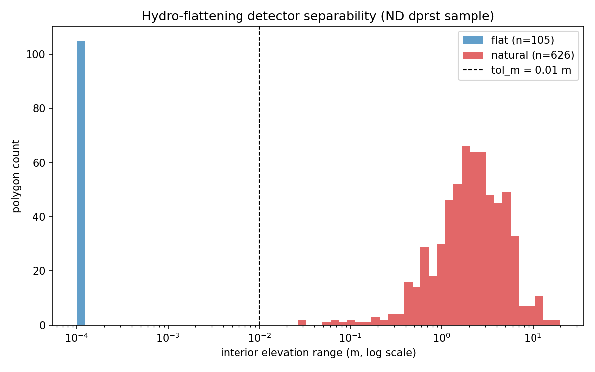
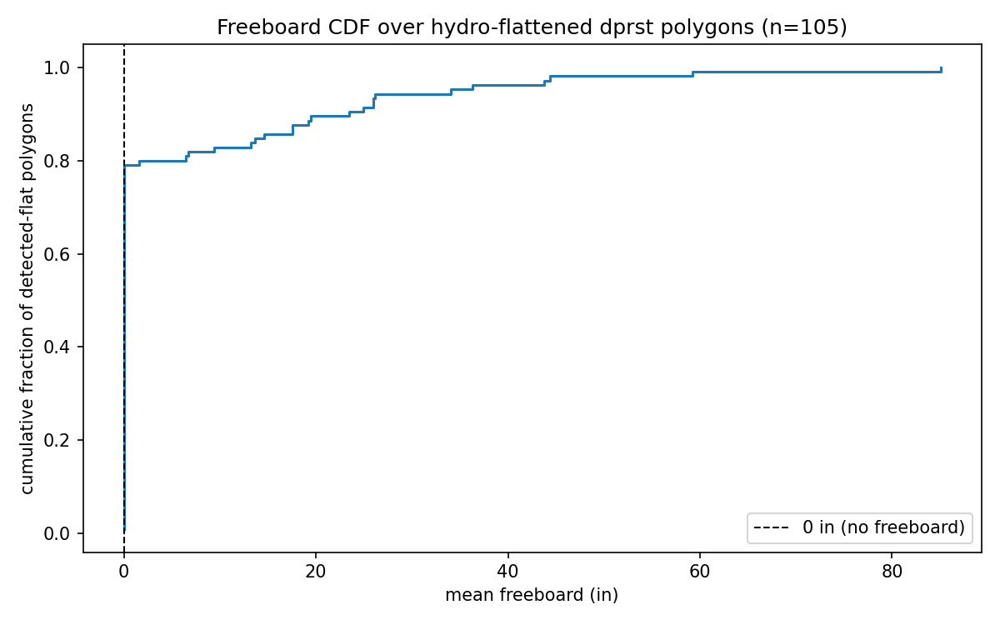
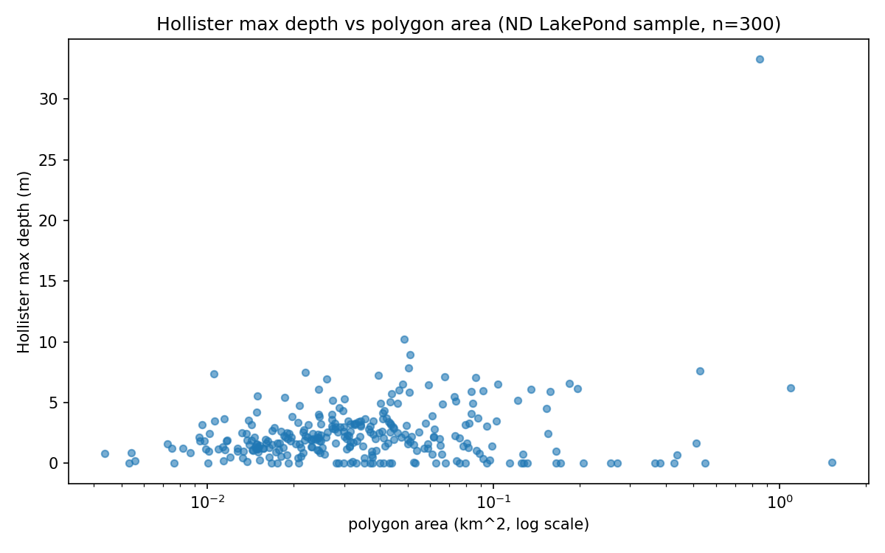
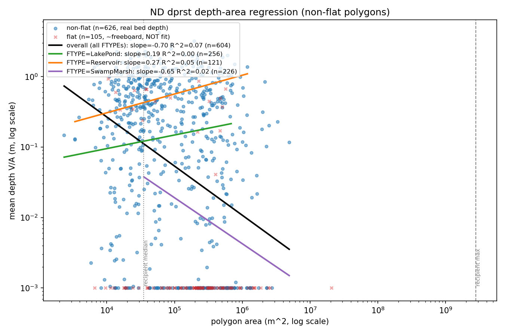

# Issue #173 Phase 0 spike: `dprst_depth_avg` from best-available topography

**Date:** 2026-07-10
**Issue:** [#173](https://github.com/rmcd-mscb/gfv2-params/issues/173) — derive
`dprst_depth_avg` from 3DEP topography over depression polygons; set
`op_flow_thres = 1.0`
**Design doc:** [`docs/superpowers/specs/2026-07-10-dprst-depth-phase0-spike-design.md`](superpowers/specs/2026-07-10-dprst-depth-phase0-spike-design.md)
**Scope:** the Phase 0 prerequisite spike only — no builder, no DAG
registration, no config block, no `tests/test_*` for a `dprst_depth` builder.
Those are Phase 1, gated on this spike's decision.

## 1. Executive summary

**GO** — proceed to a Phase 1 `dprst_depth` builder using a three-tier,
per-polygon method: raw-DEM measured depth for the non-flat majority,
Hollister terrain-slope for the hydro-flattened minority, and the documented
constant (NHM median 49 in) as a last-resort fallback — **not** a depth–area
regression, which this spike shows is not predictive.

The issue's feared worst case — that up to **~89%** of dprst open-water area
is hydro-flattened and therefore blind to a raw-DEM depth read — **does not
hold** on the North Dakota Prairie Pothole Region (PPR) sample measured here.
The large majority of dprst polygons expose real terrain in the DEM.

One-line per-FTYPE verdict:

| FTYPE | Verdict |
|---|---|
| SwampMarsh | 21.7% flattened → raw-DEM depth for the 78% majority, Hollister for the flattened 22% |
| LakePond | 11.0% flattened → raw-DEM depth for the 89% majority, Hollister for the flattened 11% |
| Playa | dry, DEM = bed → raw-DEM depth is the full depth, no flattening issue |
| Reservoir | 5.4% flattened → raw-DEM depth for the 95% majority; some flattened Reservoirs retain real freeboard |

**Primary caveat:** this is a single ND PPR project. Prairie potholes are
shallow, often ephemeral glacial depressions and are plausibly *systematically
less* hydro-flattened than deep, permanently-inundated humid-region lakes or
engineered reservoirs elsewhere in CONUS. Generalizing these flattened-fraction
numbers nationally is **unverified** — see §7.

## 2. Study area & sample

- **Region:** Prairie Pothole Region, North Dakota — the issue's own
  recommended study area, and the Hay and others (2018) PRMS depression-
  storage calibration site (comparison point).
- **3DEP project:** `ND_3DEPProcessing_D22`, chosen **programmatically**
  (not hardcoded) as the 1 m WESM project with the densest gfv2-dprst
  polygon-centroid overlap within an ND bounding box. It won by a ~7×
  margin over the runner-up (22,715 vs. 3,082 overlapping dprst centroids);
  see the ranking in the Task 4 report.
- **Sample:** 731 dprst polygons drawn from that project, target
  N=300/FTYPE (fixed seed 173), all available used where a FTYPE has fewer
  than 300 in the project (never silently capped):

  | FTYPE | n_sampled |
  |---|---:|
  | SwampMarsh | 300 |
  | LakePond | 300 |
  | Reservoir | 130 |
  | Playa | 1 |

  Only 1 Playa exists in this ND project (playas are an arid-West FTYPE) —
  this sample cannot settle Playa flattening/regression questions; Playa is
  handled qualitatively (dry → DEM is the bed) and its large-area
  extrapolation is deferred (§6).
- **Representativeness:** **100% of the sample (731/731) read at 1 m**
  resolution — none fell back to 10 m. This is a best-case resolution
  scenario for the ND project chosen; §3 (coverage) shows it also holds
  CONUS-wide to a first approximation.
- **Reused, not re-derived:** the sample is drawn from the existing shipped
  `dprst` classification (`wbody_connectivity` → `dprst`, per
  `conus_waterbodies.gpkg` minus connected/flow-through COMIDs, Ice Mass
  excluded, Playa forced in) — the spike measures the shipped product, it
  does not touch the classifier.

## 3. Evidence 1 — Coverage audit: best-available resolution per polygon

**Method.** Overlay all 286,026 CONUS dprst polygons against the WESM 1 m
project-footprint index (`onemeter_category` in `Meets`/`Meets with
variance`), tag each polygon `1m` or `10m` (10 m seamless is the full-CONUS
floor), aggregate by VPU. Script: `scripts/diagnose/dprst_depth_probe.py
--audit`; artifact: `coverage_audit.csv` (37 rows, per-VPU).

**Table — national split:**

| Tier | Polygons | % by count | Area (km²) | % by area |
|---|---:|---:|---:|---:|
| 1 m (QL1/QL2) | 282,199 | 98.7% | 52,505.4 | 98.8% |
| 10 m (seamless floor) | 3,827 | 1.3% | 649.1 | 1.2% |

Sanity check against the issue's reference figures: 286,026 polygons /
53,154.5 km² measured vs. 285,998 / 53,159 km² referenced — effectively exact
(+0.01%/−0.01%).

**Per-VPU:** 7 VPUs are 100% 1 m by both count and area (01, 02, 04, 05, 06,
10L, 18); the lowest 1 m% by area is VPU 15 at 94.1%, still well above 90%.
6,745 polygons (2.4% of the national total) had centroids outside every HRU
polygon (coastal/edge slivers) and are logged `unassigned` rather than
silently dropped.

**Finding.** **Coverage is never the blocker** — the resolution ladder (1 m →
10 m → constant) means every dprst polygon gets a real topographic read at
one of the two resolutions. **Caveat:** the 98.7%/98.8% figure is a
**convex-hull upper bound**, not a per-pixel guarantee — WESM workunit
footprints (thousands of polygon parts per feature in some cases) were
collapsed to their convex hull for tractability on this HPC's memory ceiling,
which can only ever overstate 1 m coverage, never understate it. Treat it as
"almost certainly ≥90%, possibly a few points lower than 98.7%," not a
literal per-pixel claim.

## 4. Evidence 2 — Flatness-detector validation

**Method.** `is_hydroflattened(dem_in_polygon, tol_m=0.01)` classifies a
polygon's interior as flat if its elevation **range** (max − min, not
variance) is below 0.01 m — hydro-flattened water surfaces are
breakline-enforced to be *exactly* constant per the USGS Lidar Base
Specification, so range is the discriminating statistic, not σ. Validated
against a synthetic constant surface (flat) and a constant-plus-gradient
surface (not flat), then against real data.

**Figure:** `flatness_separability.png` — log-scale histogram of interior
range across the full 731-polygon sample, flat vs. natural, with the
`tol_m = 0.01` line.

**Finding — clean separability, no ambiguous middle:**

- All 105 flat-classified polygons read **exactly 0.000 m** interior range
  (mean 0.0, max 0.0) — a single constant elevation, not merely low-variance.
- The 626 natural-classified polygons span **0.027–19.67 m** range (median
  2.15 m) — the smallest natural value (0.027 m) sits just above the 0.01 m
  tolerance, so the threshold is well-placed.
- Interior-mask validation: a real flattened LakePond read exactly 0.0 m
  range over 31,683 cells; classification was stable under 1–10 m inward
  erosion for both a large flat polygon (stays flat) and a moderate
  non-flat polygon (92% of cells >0.01 m off-median, stays non-flat) — the
  non-flat verdicts are genuine natural bathymetry, not a shoreline-mismatch
  artifact.

## 5. Evidence 3 — SwampMarsh flattened fraction (50.5% of dprst area)

**Method.** Apply the validated detector to the 731-polygon per-FTYPE
sample. This is the single highest-value number in the spike: SwampMarsh
alone is 50.5% of CONUS dprst area, so its flattened rate dominates the
overall risk assessment. (Per-FTYPE area shares — SwampMarsh 50.5%, LakePond
36.6%, Playa 10.8%, Reservoir 1.9% — are from Issue #173's prior dprst-exposure
measurement, not reproduced by this spike's CSVs; they are used here as
fixed weights.)

**Table:** `flatness_by_ftype.csv`

| FTYPE | n_sampled | n_flat | % flat | range median (m) | range p90 (m) | 1m-read |
|---|---:|---:|---:|---:|---:|---:|
| SwampMarsh | 300 | 65 | **21.7%** | 2.26 | 6.06 | 100% |
| LakePond | 300 | 33 | 11.0% | 1.28 | 3.81 | 100% |
| Reservoir | 130 | 7 | 5.4% | 2.40 | 5.76 | 100% |
| Playa | 1 | 0 | 0.0% | 3.55 | 3.55 | 100% |

**Finding.** The measured SwampMarsh flattened rate (21.7%) is **far below**
the issue's feared ~89% worst case — even the union of all three wet FTYPEs
(SwampMarsh + LakePond + Reservoir) runs 5–22% flattened, not ~89%. On this
evidence, **the "89% worst case" does not hold** in the Prairie Pothole
Region. **This inverts the issue's fear** and is the spike's central result.

**Validity caveat (carried through to §7):** single ND PPR project.
Generalizing 11–22% flattened nationally is unverified — see §7 for the
required Phase 1 follow-up.

## 6. Evidence 4 — Freeboard over hydro-flattened polygons

**Method.** For all 105 Task-4 detected-flat polygons, compute
`filled − raw` (= depth-to-spill) over the polygon interior via the same
`read_window → depth_to_spill → volume_mean_depth` pipeline. Non-trivial
freeboard would mean the baseline raw-DEM read already carries most of the
storage signal even for flattened ponds; ≈0 would mean the flat water plane
sits at the spill point (outlet-controlled) and the terrain model must
supply the submerged volume separately.

**Figure:** `freeboard_cdf.png` — step CDF of mean freeboard (inches) across
the 105 flat polygons.

**Table:** `freeboard_dist.csv` (105 usable / 105 flat input)

| Statistic | Value |
|---|---|
| median | 0.00 in |
| p10 | 0.00 in |
| p90 | 21.90 in |

**Finding.** Freeboard over the flattened minority is **essentially zero at
the median** — most flattened ponds have `frac_interior_wet = 0.00` (filled
== raw), meaning the flat water plane sits exactly at the spill point
(outlet-controlled). Baseline `depth_to_spill` captures ~0 storage for
them; **the terrain model (Hollister, §7) must supply their submerged
volume.** Exception: some Reservoirs retain real freeboard (13–17 in,
`frac_wet = 1.00`) — they store below spill, and for those the raw-DEM
freeboard signal is directly usable.

## 7. Evidence 5 — Hollister terrain-slope prototype (LakePond)

**Method.** Reimplemented a `lakeMorpho`-style `lakeMaxDepth` terrain-slope
extension: shoreline-ring mean slope (`np.gradient` over a 2-cell dilation
ring) × max in-polygon distance-to-shore (Euclidean distance transform). Run
over the full n=300 LakePond sample (not restricted to the flattened
subset). Max-to-mean conversion uses a **cone** factor (`mean = max/3`,
i.e. `V/A` of a right circular cone) — the documented, best-available
placeholder per the design doc; no field bathymetry survey was available in
this spike to calibrate the factor empirically (paraboloid `1/2` and
cylinder `1.0` are also implemented for future recalibration).

**Figure:** `hollister_maxdepth_vs_area.png` — max depth vs. polygon area
scatter, LakePond sample.

**Table:** `hollister_sample.csv` (n=300, full run)

| Statistic | max_depth (m) | mean_depth via cone (in) |
|---|---:|---:|
| median | 1.94 | 25.4 |
| p10 | 0.00 | — |
| p90 | 5.16 | — |

**Finding.** Magnitudes are **plausible** (a few metres, non-negative) and
**order-of-magnitude consistent** with the NHM calibrated `dprst_depth_avg`
median of ~49 in — shallower, as expected for shallow ND prairie potholes
vs. a CONUS-wide calibrated figure. Robust at n=300 (an n=8 smoke-test
outlier of 33 m did not dominate; p90 is only 5.16 m). **Known issue,
Phase 1 fix required:** `lake_max_depth`'s shoreline ring does not exclude
the `-9999` nodata sentinel from the slope calculation, producing a rare
tail of outliers (the 33 m case) — interpret current results via
median/IQR, not raw max, until this is fixed. **Verdict: viable for the
hydro-flattened minority**, where §6 showed freeboard ≈ 0 and the terrain
model must carry the submerged volume.

## 8. Evidence 6 — Depth–area regression (playa-anchored)

**Method.** Fit log–log `depth ~ area` (and the equivalent V–A) power laws
on the non-flat subset of the 731-polygon sample (flat polygons excluded —
their measured depth is ~freeboard, not real bed depth, per §6), both
overall and stratified by FTYPE. The design's playa-anchored large-area
donor strategy (dry playas expose bare bed even at large area, extending
the donor range toward the recipient's) could not be exercised: the ND PPR
project has only 1 Playa polygon (playas are an arid-West landform), too few
to fit or validate a regression — **deferred**, not silently dropped, to a
follow-up arid-West 1 m project.

**Figure:** `depth_area_regression.png` — log-log scatter, flat vs. non-flat
markers, fitted lines, recipient median/max area guide lines.

**Table:** `depth_area_regression.csv` (n=731 sampled, 626 non-flat, 604
usable for the fit)

| Fit | n | slope | R² |
|---|---:|---:|---:|
| Overall | 604 | −0.697 | **0.071** |
| LakePond | 256 | 0.193 | 0.004 |
| Reservoir | 121 | 0.266 | 0.048 |
| SwampMarsh | 226 | −0.652 | 0.015 |
| Playa | 1 (skipped, n<3) | — | — |

**Finding.** Verdict logged by the run: **STRATIFY** (per-FTYPE slopes
diverge, spread 0.919) — but even stratified, R² is essentially zero
(0.004–0.048). **Depth does not predict from area, stratified or not.** The
regression fallback tier is **weak**; the true documented fallback is the
**constant** (NHM calibrated median 49 in), not a fitted depth–area law.
Extrapolation risk is also severe on its own terms: the donor (measured)
area range tops out ~569× below the recipient population's max area — even
a well-fit regression would be extrapolating far beyond its calibration
range for the largest dprst polygons.

## 9. Decision table

| FTYPE | % dprst area | Best topo | Flattened? | Method chosen | Fallback |
|---|---:|---|---|---|---|
| SwampMarsh | 50.5 | 1 m (98.7% CONUS; 100% in ND sample) | 21.7% (empirical, ND PPR) | Raw-DEM `depth_to_spill` (78.3% of polygons); Hollister terrain-slope for the flattened 21.7% | Constant 49 in (NHM median) |
| LakePond | 36.6 | 1 m | 11.0% (empirical) | Raw-DEM `depth_to_spill` (89.0%); Hollister for the flattened 11.0% | Constant 49 in |
| Playa | 10.8 | 1 m | n/a (dry; DEM = bed) | Raw-DEM `depth_to_spill` = full depth (no flattening issue) | Constant 49 in (if 1 m/10 m read fails) |
| Reservoir | 1.9 | 1 m | 5.4% (empirical) | Raw-DEM `depth_to_spill` (94.6%; some retain real freeboard even when flat); Hollister for the flattened 5.4% | Constant 49 in |

Depth–area regression is **not** in the "method chosen" column for any
FTYPE — §8 shows it is not predictive (R² 0.004–0.071 even stratified) and
is demoted to informational-only; the constant is the true fallback tier.

## 10. Projected CONUS bucketing

Applying the ND PPR flattened rates and the coverage-audit resolution split
as a defensible (not certain — see caveat) estimate of the national dprst
area split, weighted by each FTYPE's share of dprst area:

| Method bucket | Approx. area share |
|---|---:|
| Raw-DEM measured depth (`depth_to_spill`, non-flat majority) | **~85–90%** of dprst area (weighted: SwampMarsh 78.3%×50.5% + LakePond 89.0%×36.6% + Playa 100%×10.8% + Reservoir 94.6%×1.9% ≈ 85%) |
| Hollister terrain-slope (flattened minority, freeboard ≈ 0) | **~10–15%** of dprst area (the complement, weighted the same way ≈ 15%) |
| Constant fallback (49 in) | Small residual — polygons where even the 10 m floor read fails, or where Hollister's shoreline-ring slope is degenerate (flat surrounding terrain) |

At 98.7–98.8% national 1 m coverage (§3, itself a convex-hull upper bound)
and only 1.2–1.3% falling to the 10 m floor, the resolution split is not
expected to materially change which method bucket a polygon lands in — 10 m
still supports both raw-DEM depth and Hollister, just at coarser fidelity.

**This bucketing is a defensible estimate anchored on the ND PPR sample, not
a validated national rate** — see the go/no-go caveat below before treating
these percentages as CONUS truth.

## 11. Go/no-go & Phase 1 recommendation

**Decision: GO.** The layered method is defensible on the evidence gathered:

1. **Non-flat majority (~80–95% of polygons per FTYPE, §5)** → raw-DEM
   `depth_to_spill` volume/area gives real, measured depth.
2. **Flattened minority** → freeboard ≈ 0 there (§6), so the raw DEM alone
   is blind to their storage; Hollister terrain-slope max-depth × cone(1/3)
   (§7) is plausible and order-of-magnitude consistent with the NHM
   calibrated reference, and is the right tool for exactly this subset.
3. **Constant (NHM median 49 in)** is the documented fallback tier for
   residual failures — **not** a fitted depth–area regression, which §8
   shows carries essentially no predictive power (R² 0.004–0.071) even
   stratified by FTYPE, and which cannot be safely extrapolated ~569× beyond
   its donor area range regardless.

**`op_flow_thres = 1.0`:** this is now **supportable**, because dprst
storage capacity would be a **measured** per-polygon quantity (raw-DEM or
Hollister-derived) rather than a calibrated constant standing in for
unknown capacity. This is a Phase 1 emission decision, not exercised in this
spike, but the spike removes the main technical objection (that depth was
previously unmeasurable at scale). **Flag:** if CONUS generalization (below)
fails and the constant-fallback share turns out to be large, revisit
`op_flow_thres = 1.0` before shipping it — a large constant-fallback bucket
means capacity is still effectively a constant for those HRUs.

### Phase 1 requirements this spike surfaces

- **Emit a per-polygon flatness flag + method/resolution provenance.** Do
  **not** assume the ND PPR flattened rates apply nationally — the
  per-polygon `is_hydroflattened` test is cheap (it is exactly the read this
  spike already performs) and sidesteps the generalization problem entirely;
  each polygon is classified on its own DEM, not by an assumed regional
  rate.
- **Fix the `lake_max_depth` nodata-in-ring guard** (§7) before trusting
  Hollister broadly — the shoreline ring must exclude `-9999` sentinel
  cells to avoid the rare large-outlier tail observed.
- **Validate the playa anchor and generalization** on at least one
  arid-West 1 m project (for the playa-anchored large-area regression
  donor, §8) and at least one humid-region/reservoir-heavy 1 m project (for
  the flattened-fraction generalization, §5) before trusting a national
  rate for either.
- **Docs deferral (repo doc-audit rule):** the builder-touching docs —
  `docs/pywatershed_depression_storage_requirements.md`,
  `docs/ARCHITECTURE.md`, `slurm_batch/RUNME.md`,
  `slurm_batch/HPC_REFERENCE.md` — are **not** updated by this spike. They
  document the shipped Phase 1 builder surface (DAG registration, config
  block, HPC runbook), none of which exists yet; this is a Phase 0
  investigation with no builder, no DAG node, and no config change. They
  will need updating alongside the Phase 1 `dprst_depth` builder PR, not
  this one.

## References

Issue #173; `docs/nhm_source_crosscheck_2026-07.md`;
`docs/Surface_depression_storage_Driscoll_2020.md`; Hollister, Milstead &
Urrutia 2011 (PLoS ONE 6(9):e25764); Hollister & Milstead 2010; `lakemorpho`
R package; Martinsen and others 2023; USGS Lidar Base Specification
(hydro-flattening ≥ 2 acres); Hay and others 2018 (PRMS depression-storage
calibration, Devils Lake basin ND).

## Reproducing these numbers

All artifacts were produced by `scripts/diagnose/dprst_depth_probe.py`
(five CLI modes: `--audit`, `--flatness`, `--freeboard`, `--hollister`,
`--regression`), one interactive session, no SLURM array (per the design
doc, this is a bounded spike sample, not a CONUS-scale run). Source CSVs
(not committed — scratchpad artifacts, cite by path for reproducibility):
`coverage_audit.csv`, `flatness_by_ftype.csv`, `flatness_per_polygon.csv`,
`freeboard_dist.csv`, `hollister_sample.csv`, `depth_area_regression.csv`.
Full task-by-task methodology and TDD evidence:
`.superpowers/sdd/task-{2,3,4,5,6,7}-report.md`.
