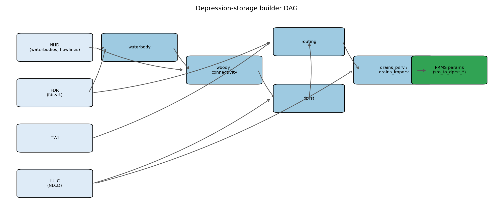
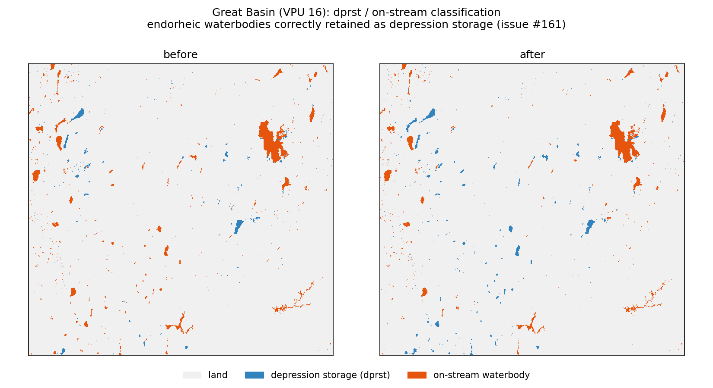
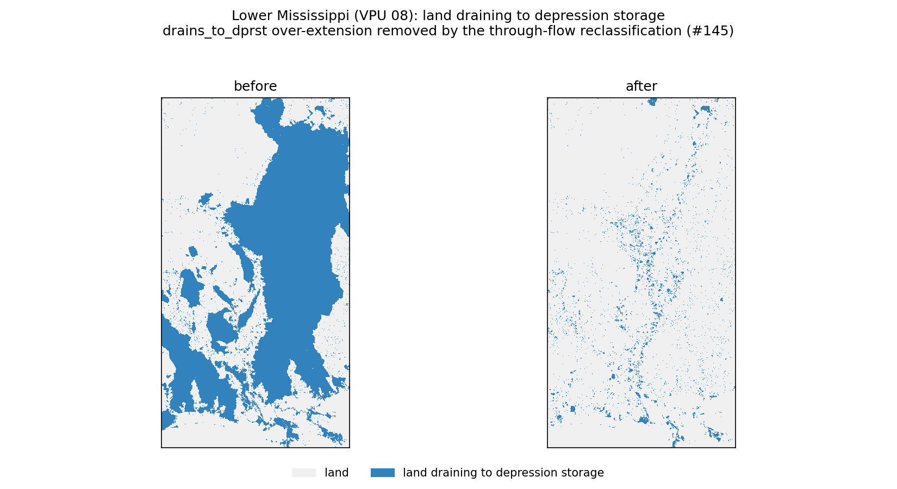
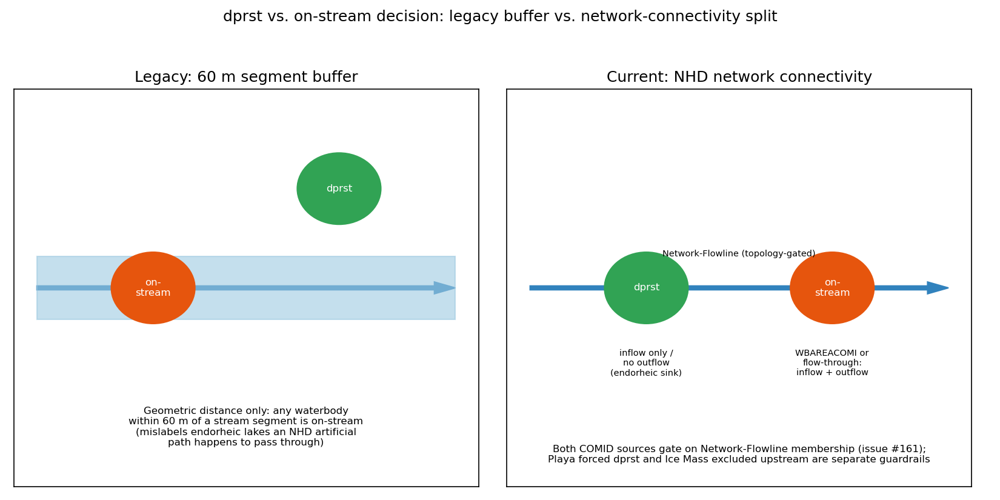

# Depression-Storage Parameters for PRMS/NHM

### From ArcGIS to an open-source, CONUS-scale pipeline

gfv2-params pipeline · Part 2a (depstor) · CONUS production (gfv2 fabric)

<!--
This talk is for modelers who know PRMS/NHM but not this pipeline's internals.
Headline: we replaced a proprietary, per-unit ArcPy workflow with a
reproducible open-source pipeline that runs at CONUS scale on SLURM. The
connectivity-based on-stream/depression classifier is the marquee
*methodological* improvement inside that bigger story — not the whole story.
-->

---

## What "depression storage" is in PRMS

PRMS routes surface runoff two ways: straight to the stream, or into a
**depression** (dprst) — a closed low spot (pothole, playa, sinkhole,
non-network lake) that fills, evaporates, and seeps instead of draining
directly downstream.

Six **spatial** (per-HRU) parameters describe this for every Hydrologic
Response Unit:

| Param | Meaning |
|---|---|
| `dprst_frac` | fraction of the HRU that is depression storage |
| `sro_to_dprst_perv` | fraction of pervious surface runoff routed to dprst |
| `sro_to_dprst_imperv` | fraction of impervious surface runoff routed to dprst |
| `carea_max` | maximum contributing (variable-source) area fraction |
| `smidx_coef` | soil-moisture-index coefficient (also from a TWI threshold) |
| `hru_percent_imperv` | impervious fraction of the HRU |

<!-- All six are per-HRU CSVs joined on nat_hru_id in params/merged/. -->

---

## Why it matters

`dprst_frac` and `sro_to_dprst_*` set **how much** runoff a HRU can even see
at the stream, and **how fast**:

- Water captured by a depression is removed from the flood hydrograph —
  it evaporates or seeps instead of contributing to peak flow.
- Get the on-stream/depression split wrong and a basin's simulated
  **runoff partition and timing** are wrong before calibration ever starts.

This is a classification problem first, a statistics problem second: which
waterbodies and low spots are truly closed, and which cells drain to them?
Get the classifier right and the zonal stats follow.

---

## Legacy workflow at a glance

`docs/0b_TB_depr_stor.py` — ArcPy + Spatial Analyst, one U.S. Geological
Survey Toolbox script, run per modeling unit by hand.

- **Language/runtime:** ArcGIS Pro/ArcMap, proprietary `arcpy.sa` raster
  algebra (`Con`, `EucDistance`, `Watershed`, `IsNull`, ...).
- **On-stream split:** a **60 m Euclidean buffer** around stream segments
  (`getSegsBuf`) — anything inside the buffer is "on-stream," everything
  else outside impervious zones is depression storage.
- **Upslope routing:** ArcPy `Watershed(fdr, dprst, "VALUE")` — floods every
  depression's contributing area with no barrier and no network awareness.
- **Thresholds:** TWI 8.0 (`carea_max`) / 15.6 (`smidx_coef`), calibrated
  once against VPU 01's ArcPy topographic-wetness-index distribution.
- **Workflow:** single-machine, single geodatabase per unit — not designed
  to run CONUS-wide.

---

## Two weaknesses of the legacy method

**1. Geometric buffer ≠ hydrologic connectivity.**
A fixed 60 m distance from a stream line says nothing about whether water
actually *reaches* that stream. A large lake with its center 61 m from the
nearest segment is "depression storage" by this rule even if it visibly
drains to the river.

**2. Endorheic (closed-basin) lakes over-promoted "on-stream."**
NHD draws artificial flowpaths straight through many closed-basin lakes for
cartographic reasons. A distance-only or unqualified-path test follows those
paths and wrongly reclassifies genuinely closed lakes (Great Basin, Great
Salt Lake tributaries) as flowing to the stream network.

Both failure modes point the same direction: distance and raw flowpath
presence are not connectivity. The fix has to test <em>network membership</em>,
not proximity.

---

## The new principle

Ground the on-stream / depression-storage split in **hydrologic connection
to the NHD stream network**, not distance or an unqualified flowpath.

> A waterbody is depression storage **unless the routed stream network
> actually connects it to the drainage system.** Proximity and cartographic
> flowpaths don't count — a network connection does.

Two independent ways to demonstrate that connection, **unioned**, both
gated on the same network-membership test — the precise rule (what counts
as connected, and what stays a closed sink) is on the next few slides.

<!--
"Network membership" = the flowline is in NHDPlus's Network-Flowline set
(PlusFlowlineVAA), i.e. it participates in the routed, directional stream
network — not one of the many Non-Network artificial paths NHD draws for
cartography through lakes, including closed-basin ones.
-->

---

## Open-source stack + reproducibility

Every ArcPy call has an open-source equivalent; the whole pipeline now runs
unattended, at CONUS scale, from source control.

- **Raster algebra:** `rasterio`/`numpy` (replaces `arcpy.sa.Con`/raster ops)
- **Hydrologic conditioning:** `richdem` + WhiteboxTools (fill, flow direction)
- **D8 routing kernel:** in-process, per-VPU tiled (replaces `arcpy.sa.Watershed`)
- **Zonal statistics:** `gdptools` (partial-pixel-weighted, replaces Zonal Statistics)
- **Environment:** `pixi` — pinned, reproducible, no ArcGIS license needed
- **Orchestration:** SLURM batch arrays — CONUS runs unattended, not by hand

NHD + FDR + TWI + LULC feed waterbody classification, connectivity,
depression identification, D8 routing, and same-HRU restriction → the six PRMS params.

---

## Identifying dprst waterbodies

A waterbody is a depression **unless** it is on-stream. On-stream status
comes from the **union of two independent evidence sources**, both gated on
NHDPlus **Network-Flowline** membership (excludes cartographic Non-Network
artificial paths):

- **WBAREACOMI topology** — the waterbody is threaded by an artificial path
  belonging to a Network Flowline.
- **Geometric flow-through** — a Network flowline demonstrably enters *and*
  exits the waterbody (or is a routed-network headwater/outflow source).

Two hard-coded overrides regardless of connectivity:
- **Playa** → always depression storage (force-dprst); never promoted on-stream.
- **Ice Mass** (glaciers) → not depression storage *or* on-stream; excluded
  from the waterbody classification entirely (falls back to land/LULC).

---

## The endorheic fix

Gating both connectivity sources on Network-Flowline membership stops
Non-Network cartographic paths from promoting closed-basin lakes on-stream.

Great Basin: endorheic waterbodies previously miscoded on-stream are
correctly retained as depression storage after the network gate.

These lakes have no natural outlet — treating them as "on-stream" would let
modeled runoff flow out of a basin that, hydrologically, has nowhere to go.

---

## `drains_to_dprst`: D8 kernel + on-stream barrier

Which land cells drain *to* a depression? The legacy `Watershed()` call
floods every depression's full upslope area with no regard for what's in
between. The new D8 kernel adds a rule the legacy tool never had:

An on-stream waterbody is a <strong>traversal barrier</strong>. A cell's D8
flow trace stops the moment it reaches any on-stream waterbody cell — before
it can reach a depression further downslope. That land is already captured
by the on-stream water's own stream/lake routing; it must not also be
double-attributed to a depression behind it.

- Barrier set = the *full* on-stream mask (no size filtering).
- Playas are never barriers (they're never on-stream).
- The fix only **removes** false drains-to-dprst coverage — never adds any.

---

## The over-extension fix

Without the on-stream barrier, `drains_to_dprst` over-extends deep into
open-drainage basins wherever an on-stream lake sits between land and a
depression.

Lower Mississippi: land draining to depression storage, before vs. after the
connectivity-grounding fixes (cumulative: through-flow reclassification, topology-aware
source-lake promotion, on-stream barriers, Network-Flowline gate). Lower Miss basin
~70% → 8.6%; CONUS-wide ~26% → 8.3%.

The fix is in the <em>classifier</em> (barrier-aware routing), never a cap on
coverage — a cap can't tell a legitimately large endorheic basin (Great
Basin) apart from a spurious one (Lower Miss) and would damage the correct case.

---

## same-HRU restriction on `sro_to_dprst_*`

The legacy script already restricted its surface-runoff-to-depression ratio
to same-HRU drainage: `Con(rSro == hru)` — count a cell only if the
depression it drains to belongs to *this cell's own* HRU (`docs/0b_TB_depr_stor.py:214`).

The new pipeline reproduces that rule explicitly in raster space:

- Per-cell `drains_to_dprst_hru` raster (which HRU's depression does this
  cell reach?) compared cell-by-cell against `hru_id`.
- This is a per-cell **reached-HRU-vs-own-HRU** test — not expressible as a
  `gdptools` partial-pixel zonal weight, so it's computed as a raster
  intersection *before* the per-HRU `gdptools` aggregation.
- `drains_to_dprst` itself (feeding `dprst_frac`) stays HRU-agnostic — only
  the `sro_to_dprst_perv`/`imperv` **ratios** get this restriction.

---

## Legacy vs. new: the decision

Legacy: fixed-distance buffer around segment lines. New: does a
Network-Flowline actually flow through the waterbody (in, out, or both)?

Same question either way — "is this water on-stream?" — but the new test
asks the network, not a ruler.

---

## Products: what pyWatershed consumes

`gfv2/params/merged/` supplies all **6 spatial** parameters
`pywatershed.hydrology.prms_runoff.PRMSRunoff` requires, each a
`nat_hru_id,<param>` CSV (rebuilt Jul 5 2026 from the grounded classifier).

The remaining 11 non-spatial parameters are a priori constants, not
zonal-stats products:

- **8 already match** the legacy `0b` constants exactly (e.g. `dprst_depth_avg=132`).
- **3 gaps** the legacy pipeline never emitted — adopt pyWatershed's
  documented defaults verbatim: `dprst_flow_coef` (0.05), `dprst_seep_rate_open`
  (0.02), `smidx_exp` (0.3).
- **1 needs a modeler decision:** legacy `dprst_seep_rate_close` = 0.2 vs.
  pyWatershed `dprst_seep_rate_clos` default = 0.02 — a **10×** difference,
  not just a rename.

Full gap analysis, verified against installed pyWatershed 2.0.4:
<code>docs/pywatershed_depression_storage_requirements.md</code>

---

## Known open refinements

The classifier is complete and the CONUS product reflects it — but these
are honest, tracked limitations, not blockers:

| Issue | Refinement |
|---|---|
| #154 | Reservoir bucket — managed reservoirs need their own PRMS treatment, not plain dprst |
| #155 | Permanence gate — intermittent/ephemeral waterbodies pressure-test the classifier |
| #156 | ~4% of waterbodies reclassify under a clump-merge sensitivity check |
| #157 | ~0.05% cross-VPU seam artifacts at tile boundaries |
| #147 | Depression-respecting FDR — A/B investigation of an alternate flow-direction source |

None of these are worked in this deck's scope — noted for
transparency, tracked as open issues.

---

## Summary

- **Headline:** proprietary ArcGIS/Spatial Analyst → reproducible open-source
  pipeline (rasterio/richdem/WhiteboxTools/gdptools, pixi + SLURM), now
  running at true CONUS scale.
- **Marquee methodological fix:** on-stream/depression split grounded in NHD
  Network-Flowline connectivity, replacing a 60 m Euclidean buffer — fixes
  both endorheic over-promotion (Great Basin) and `drains_to_dprst`
  over-extension (Lower Mississippi).
- **Products:** all 6 spatial pyWatershed params delivered; constants mostly
  carry over from legacy, with 3 gaps + 1 value discrepancy documented.

References: <code>docs/0b_TB_depr_stor.py</code> (legacy) · NHDPlus V2
PlusFlowlineVAA (Network-Flowline topology) ·
<code>docs/pywatershed_depression_storage_requirements.md</code> (pyWatershed contract) ·
<code>docs/ARCHITECTURE.md</code> (pipeline reference)

