# Depression-Storage Parameters for PRMS/NHM

### The classification rules, and what they look like on real hydrography

gfv2-params · Part 2a (depstor) · CONUS production (gfv2 fabric) · includes PR #178 (open)

<!--
Audience: peers reviewing the method. They know PRMS/NHM; they do not know this
pipeline's internals or NHDPlus's. The deck is rule-first: state the rule, show it
firing on a named waterbody, give the number it changed.
-->

---

## What "depression storage" is in PRMS

PRMS routes surface runoff two ways: straight to the stream, or into a
**depression** (dprst) — a closed low spot (pothole, playa, sinkhole, endorheic
lake) that fills, evaporates, and seeps instead of draining downstream.

Six **spatial** (per-HRU) parameters describe this for every HRU:

| Param | Meaning |
|---|---|
| `dprst_frac` | fraction of the HRU that is depression storage |
| `sro_to_dprst_perv` | fraction of pervious surface runoff routed to dprst |
| `sro_to_dprst_imperv` | fraction of impervious surface runoff routed to dprst |
| `carea_max` | maximum contributing (variable-source) area fraction |
| `smidx_coef` | soil-moisture-index coefficient (TWI threshold) |
| `hru_percent_imperv` | impervious fraction of the HRU |

All six are per-HRU CSVs joined on <code>nat_hru_id</code> in <code>params/merged/</code>.

---

## Why the classification is the whole ballgame

`dprst_frac` and `sro_to_dprst_*` set **how much** runoff an HRU can even
deliver to the stream, and **how fast**.

- Water captured by a depression leaves the flood hydrograph — it evaporates or
  seeps instead of contributing to peak flow.
- Get the on-stream/depression split wrong and a basin's simulated **runoff
  partition and timing are wrong before calibration ever starts** — and no
  calibration knob can put back water the model never let the basin keep.

This is a <strong>classification</strong> problem first and a statistics problem
second: which waterbodies are truly closed, and which cells drain to them? Get the
classifier right and the zonal statistics follow. The rest of this deck is the
classifier.

---

## The legacy workflow, and its two blind spots

`docs/0b_TB_depr_stor.py` — ArcPy + Spatial Analyst, run per modeling unit by
hand, one geodatabase at a time. On-stream = a **60 m Euclidean buffer** around
segment lines (`getSegsBuf`); upslope area = `Watershed(fdr, dprst, "VALUE")`,
which floods every depression's contributing area with no barriers.

**1. Geometric distance is not connectivity.** A lake whose centre is 61 m from
the nearest segment is "depression storage" even if it visibly drains to the
river; a canal 59 m away is "on-stream" even if nothing reaches it.

**2. No test that is *local* to a waterbody can see that an entire basin is
closed.** Endorheic lakes look exactly like on-stream lakes from a distance
buffer — NHD even draws artificial flowpaths straight through them.

Both blind spots point the same way: the test has to read <em>hydrology</em> —
the routed network and the flow grid — not a ruler.

---

## Open-source stack + reproducibility

Every ArcPy call has an open-source equivalent; the whole pipeline now runs
unattended, at CONUS scale, from source control.

| Legacy | Now |
|---|---|
| `arcpy.sa` raster algebra | `rasterio` / `numpy`, windowed and streamed |
| ArcHydro conditioning | `richdem` + WhiteboxTools |
| `arcpy.sa.Watershed` | in-process D8 kernel, per-VPU tiled |
| Zonal Statistics | `gdptools` (partial-pixel weighted) |
| ArcGIS licence + one desktop | `pixi` lockfile + SLURM arrays |

CONUS is 153,830 × 109,901 ≈ <strong>16.9 billion cells</strong>. Nothing holds a
full-grid array by accident — the builders window, strip, and stream.

---

## The builder DAG

Inputs (left) → the six PRMS spatial params (green). The <code>endorheic</code> step has
<strong>two</strong> downstream consumers — the on-stream subtraction and the clump-veto exemption.

<!--
nhd_topology (orange) must precede BOTH COMID steps — they read flowline_topology.parquet
(PlusFlowlineVAA) and fail loud without it. The dashed red edge is the endorheic_wbody.tif
clump-veto exemption straight into dprst, distinct from the endorheic subtraction feeding
the on-stream union.
-->

---

## Input provenance: three hand-made files were defective

PR #178 audited `input/nhd/` and found three of its four hand-made files wrong in
ways that silently corrupt the classifier:

- **`NHD_sink_points.gpkg`** omits `PURPCODE 1` ("BurnLineEvent network end")
  entirely — the class that marks a terminal lake. It has **0 sinks inside Great
  Salt Lake**; NHDPlus's own `Sink.shp` has **29**.
- **`closed_huc12.gpkg`** has **23** type-C HUC12s in the Great Basin; the full WBD
  has **141**. It resolves 1 of the 10 classic terminal lakes; the WBD resolves 5.
- The waterbody layer was missing all **66,488 SwampMarsh** polygons.

Everything now stages from NHDPlus / WBD at source —
<code>nhd_burn_components</code>, <code>wbd_huc12</code>, <code>nhd_waterbodies</code>,
<code>nhd_topology</code> — and the staging steps fail loud on an unrecognised code.

---

## The rule ladder

> **A waterbody is depression storage UNLESS it is proven on-stream.** On-stream
> must be *demonstrated*, by evidence, against the routed network.

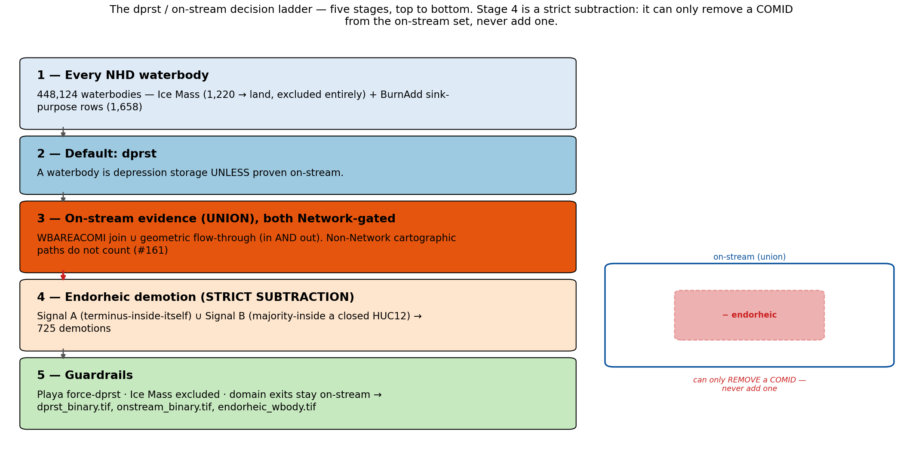

Stage 4 (endorheic) is a <strong>strict subtraction</strong> — it can only remove a COMID from
the on-stream set, never add one.

---

## Rule 1 — what counts as a waterbody

> NHDWaterbody, plus **only the sink-purpose rows** of `BurnAddWaterbody`
> (`PurpCode` 4 Playa, 5/8 closed lake). `FTYPE` comes from **`FCODE`**.

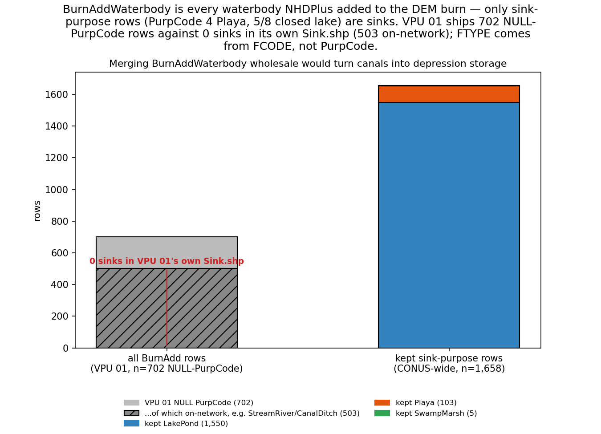

VPU 01 ships 702 NULL-<code>PurpCode</code> rows against <em>zero</em> sinks; only 1,658 sink-purpose
rows survive CONUS-wide. Merging the layer wholesale turns canals into depression storage.

<!--
BurnAddWaterbody is NOT a sink layer — it is every waterbody NHDPlus added to the DEM
burn. 503 of VPU 01's 702 rows are on-network (StreamRiver, CanalDitch). And PurpCode 5
spans Playa AND SwampMarsh, so FCODE is the only safe source of FTYPE: a Playa mislabelled
LakePond would lose its force-dprst guardrail.
-->

---

## Rule 2 — Playa and Ice Mass are hard guardrails, and are NOT equivalent

> **Playa → force-dprst**, never promoted on-stream. **Ice Mass → excluded from
> the classification entirely**; its cells fall back to land, perv/imperv via LULC.

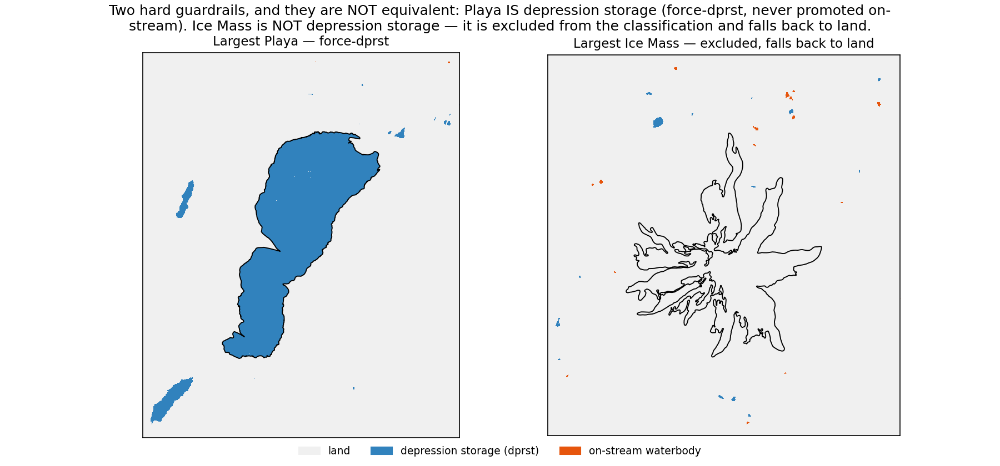

A playa <em>is</em> depression storage even when NHD threads a flowpath through it. An ice
mass is <em>not</em> depression storage at all, so it is dropped upstream of the decision
rather than forced to either side of it (1,220 CONUS-wide).

---

## Rule 3 — on-stream evidence A: the WBAREACOMI join

> On-stream if a **Network** flowline carries the waterbody's COMID in
> `WBAREACOMI` — NHD's own statement that this artificial path is the routed stream.

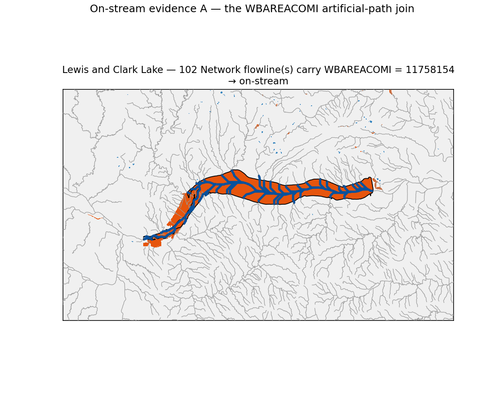

Lewis and Clark Lake: 102 Network flowlines carry <code>WBAREACOMI = 11758154</code> (blue = that
artificial path; grey = the rest of the drainage). A topological claim, not a distance.

---

## Rule 4 — on-stream evidence B: geometric flow-through

> A **Network** flowline must demonstrably **enter AND exit**. Inflow only
> (terminal sink) or outflow only (spilling pothole) stays depression storage.

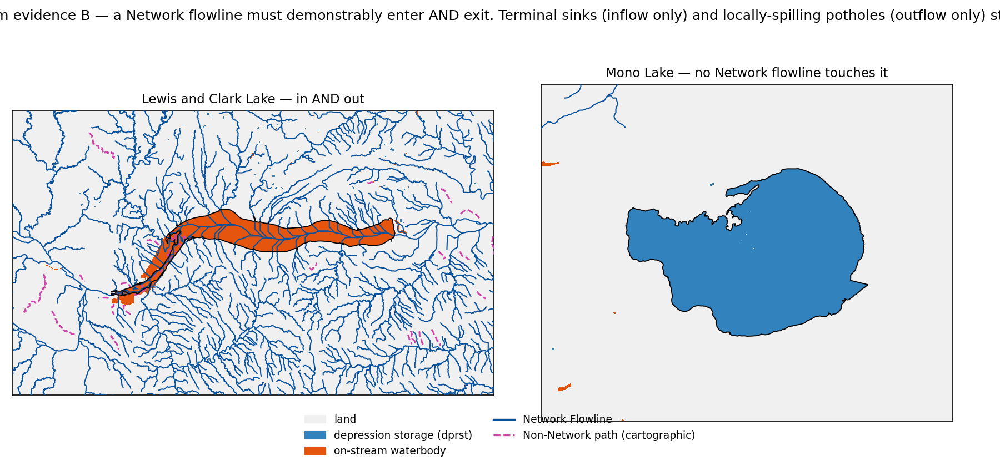

Lewis and Clark: enters and leaves → on-stream. Mono Lake: <strong>no Network flowline touches
it at all</strong> → stays dprst. Evidence A and B are <strong>unioned</strong> — either alone suffices.

<!--
The two sources are unioned rather than intersected because NHD's WBAREACOMI attribution
and its flowline geometry disagree often enough that requiring both would under-promote
real reservoirs.
-->

---

## Rule 5 — the Network-Flowline gate (#161/#163)

> Both evidence sources are gated on membership in NHDPlus's **Network Flowline**
> set. A Non-Network artificial path is cartography, not connectivity.

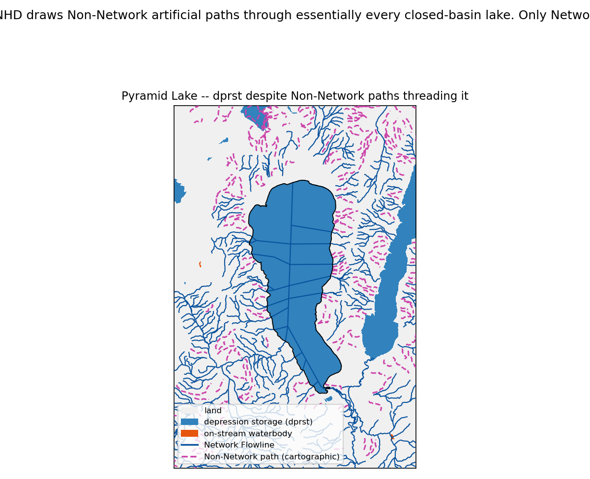

Sheepy Lake: <strong>8 Non-Network paths thread it, 3 carrying its own WBAREACOMI, ZERO Network flowlines.</strong> Ungated, both sources fire → on-stream.

<!--
COMID 2554835, VPU 18. The gate recovered ~1,039 waterbodies / 842 km² across VPUs 13/15/16/18. This is why
nhd_topology must run before both COMID steps: they read flowline_topology.parquet
(PlusFlowlineVAA) to decide what "Network" means, and both fail loud without it.
-->

---

## Rule 6 — endorheic Signal A: the terminus is inside *itself* (#178)

> `frac_own` = share of the waterbody's cells whose D8 path ends on an FDR **code-0**
> (terminal) cell *inside that same waterbody*. **dprst iff `frac_own` > 0.5.**

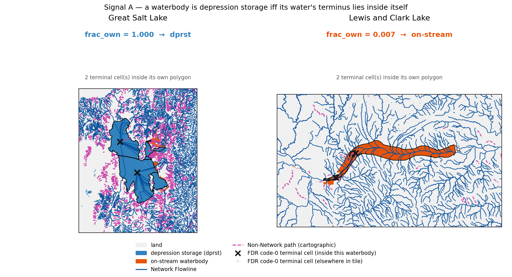

<strong>Containment is not the test</strong> — both lakes hold <strong>2</strong> in-polygon code-0 cells. GSL <code>frac_own = 1.000</code> → dprst; Lewis and Clark <code>0.007</code> → on-stream.

<!--
Lewis and Clark's other 99.3% flows through to the Missouri and out to the Gulf. A naive
"terminates at a sink" rule — testing containment, not frac_own — would demote every
on-stream reservoir in the Great Basin. That is why the rule is terminus-inside-ITSELF.
-->

---

## Rule 6, continued — 0.5 is not a tuned knob

The classifier reads the **same FDR grid with the same D8 kernel as the router**, so
the two agree by construction. And the threshold is **inert**:

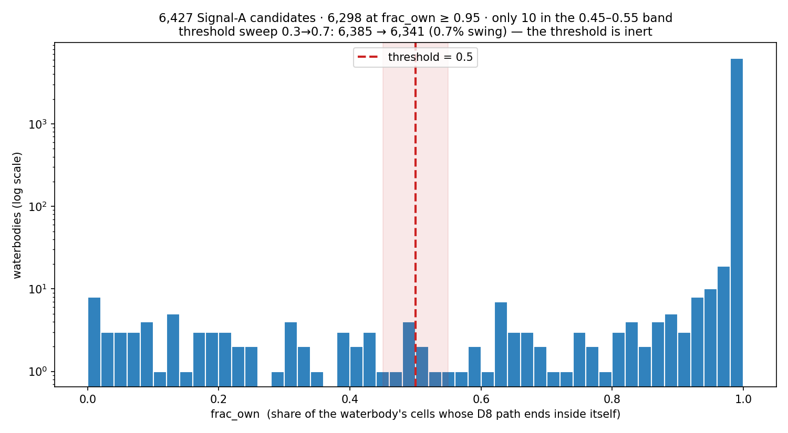

6,427 candidates; <strong>6,298 at <code>frac_own</code> ≥ 0.95</strong> (log scale). Only <strong>10</strong> near 0.5; a 0.3 → 0.7 threshold sweep moves the answer <strong>0.69%</strong>.

---

## Rule 7 — endorheic Signal B: majority-inside a closed HUC12

> Also endorheic if the **majority of its area** falls in a WBD **type-C (closed)**
> HUC12. Majority-**area** — never `intersects`, never `within`.

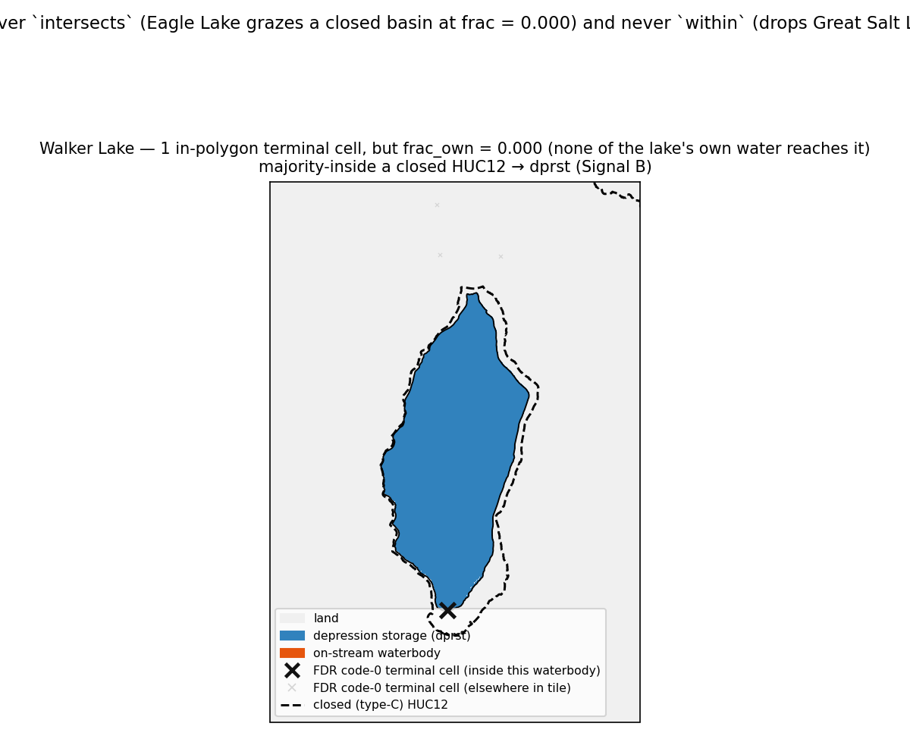

Walker Lake: 1 in-polygon terminal cell but <code>frac_own = 0.000</code>. <strong>Signal A misses it; Signal B catches it.</strong>

<!--
intersects: Eagle Lake and Middle Alkali graze closed basins at frac = 0.000 and would
wrongly demote. within: drops Great Salt Lake, which spills 1.1% into a neighbouring
HUC12 at frac = 0.989. Majority-area is the only predicate that gets both right.
-->

---

## Rule 8 — guardrail: domain exits must stay on-stream

> A waterbody that is terminal **only because the CONUS model ends there** is not
> endorheic. Ten named fixtures must never be demoted.

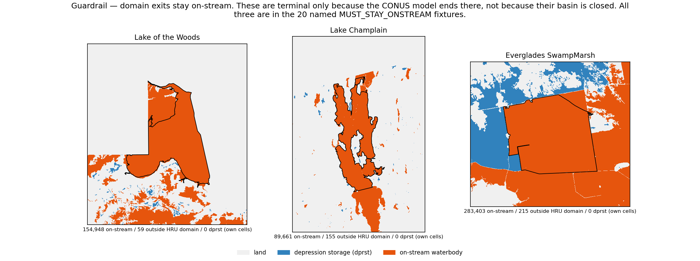

Lake of the Woods, Champlain, the Everglades — all on-stream, <strong>0 dprst cells</strong>, <strong>no guard
needed</strong>: their water does not terminate inside them.

<!--
Every attribute-based guard tried during design broke here: a fabric-network "segments
enter but none leave" rule flagged Lake Michigan; NHDPlus LandSea was useless; the WBD's
frontal type missed Champlain. The Great Lakes' open water lies OUTSIDE the HRU domain
(62,759 nodata cells), so it cannot even render on-stream — Michigan is still a fixture,
but it cannot be drawn as one, which is why the figure uses Lake of the Woods.
-->

---

## Rule 9 — the clump veto, and its exemption (#178's second bug)

Demoting Great Salt Lake was **not enough**: `dprst` labels 8-connected waterbody
*regions*, and drops a **whole region** if any one cell touches the on-stream mask.

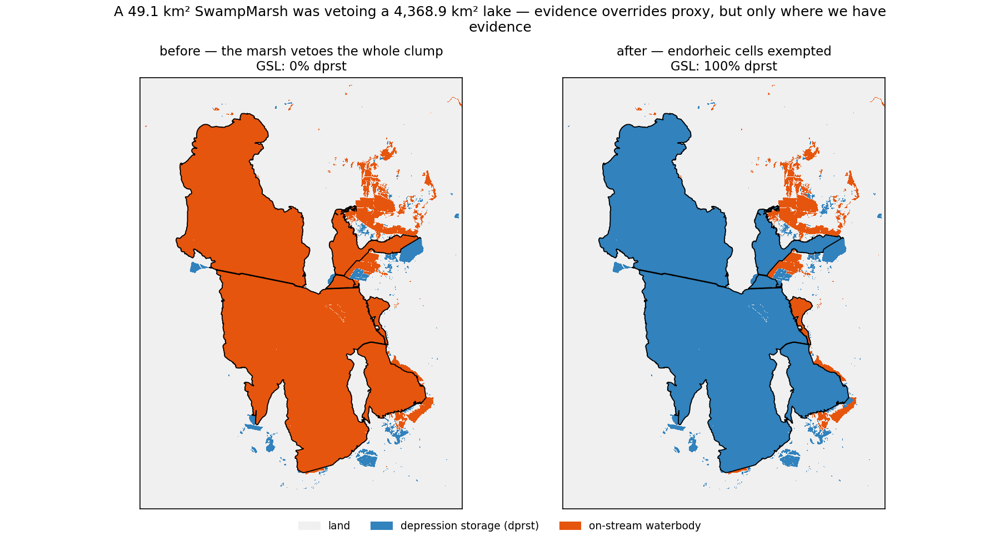

A <strong>49.1 km²</strong> on-stream SwampMarsh (its water drains <em>into</em> GSL) is 8-connected to the
<strong>4,368.9 km²</strong> lake, so it vetoed the whole clump — <strong>4,854,156 GSL cells</strong> silently
excluded. Fix: exempt an endorheic body's own not-on-stream cells (<code>endorheic_wbody.tif</code>).

<!--
"Evidence overrides proxy — but only where we have evidence." A global per-cell on-stream
carve was considered and REJECTED: it recovers a further ~8,471 km² of waterbodies whose
clump merely abuts an on-stream feature, with no endorheic evidence at all. The exemption
is deliberately narrower, and cannot re-open the drains_to_dprst over-extension bugs.
-->

---

## Impervious is carved per-cell, never whole-region (#144)

The same "one cell vetoes a region" bug once ran through the impervious mask: a
single NLCD ≥50%-impervious pixel excluded an entire multi-km² waterbody clump
from depression storage — a **~16,800 km²** CONUS-wide false exclusion.

- Impervious is now masked out of `dprst` **cell by cell**, restoring the legacy
  ArcPy `getDprst` "outside of impervious zones" behaviour.
- The imperv / dprst / perv cell partition stays **disjoint** — no double-count.
- Every depstor raster is masked against `land_mask.tif` (the HRU fabric
  rasterised), never against hydro-DEM nodata or the FDR.

The imperv 50% threshold is a <em>land-classification</em> lever — which cells are
impervious. It is <strong>not</strong> a knob for tuning how much dprst gets excluded.

---

## `drains_to_dprst`: D8 + the on-stream barrier (#158/#159)

Which land cells drain *to* a depression? Legacy `Watershed()` floods every
depression's full upslope area with no regard for what lies between.

An on-stream waterbody is a <strong>traversal barrier</strong>. A cell's D8 trace stops at
the first on-stream waterbody cell it hits, before it can reach a depression behind it
— that land is already captured by the lake's own routing and must not be
double-attributed to a depression.

- Barrier set = the **full** on-stream mask (no size filtering). Playas are never
  barriers, because they are never on-stream.
- Strict subtraction: the barrier can only **remove** `drains_to_dprst` coverage.
- Validated at CONUS in PR #145/#158/#159: `drains_to_dprst` land coverage
  **26% → 8.3%**; Lower Mississippi **~70% → 8.6%**.

No before/after figure exists for this fix: the only snapshot that could isolate it
(<code>pre_flowthrough_2026-06-26</code>) has been deleted, and <code>drains_to_dprst</code> is byte-identical
across the two surviving snapshots. The CONUS numbers are a historical result, not re-derived here.

---

## same-HRU restriction on `sro_to_dprst_*` (#160/#162)

The legacy script counted a cell only if the depression it drains to belongs to
**that cell's own HRU**: `Con(rSro == hru)` (`docs/0b_TB_depr_stor.py:214`). The
new pipeline reproduces the rule explicitly, in raster space:

- A labelled, barrier-aware routing pass emits `drains_to_dprst_hru` — *which*
  HRU's depression does this cell reach? — compared cell-by-cell against `hru_id`.
- This is a per-cell **reached-HRU-vs-own-HRU** test. `gdptools`' partial-pixel
  zonal weighting cannot express it, so it is computed as a raster intersection
  *before* the per-HRU aggregation (which is still `gdptools`).
- `drains_to_dprst` itself (feeding `dprst_frac`) stays HRU-agnostic — only the
  `sro_to_dprst_perv` / `sro_to_dprst_imperv` **ratios** get the restriction.

---

## `dprst_depth_avg` (#173)

The depth of a depression is not in the DEM: **99.9% of dprst area is ≥2 acres**,
and 3DEP hydro-flattens waterbodies at that size to a constant surface. The
raw-DEM donor pool is the remaining 0.1%.

A layered estimator, gated by a per-polygon flatness flag:

1. **Raw depth** where 3DEP did not flatten the polygon (the majority in the
   pothole belt — flattened rates there run only 5–22%).
2. **Freeboard + Hollister terrain-slope bathymetry** where it did.
3. A **playa-anchored calibration** of the Hollister coefficient.

CONUS product on disk: 361,471 HRUs, **median 10.7 in** — against the legacy
constant of 132 in, and the NHM-calibrated median of 49 in.

---

## CONUS result — depression storage

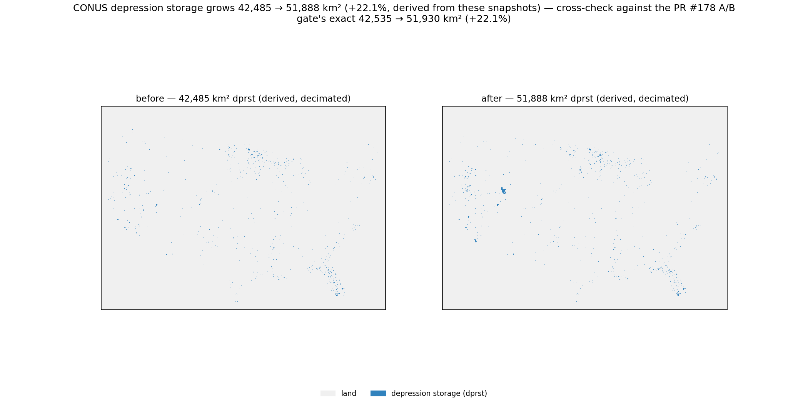

<strong>42,535 → 51,930 km² (+22.1%)</strong> (PR #178 A/B gate; re-derived within 0.1%). The endorheic table is a <strong>SET</strong> of 22,970 COMIDs; only those also on-stream get subtracted — hence <strong>725 demotions</strong>, not 22,970.

<!--
Endorheic set breakdown: 6,364 by terminus, 21,503 by closed HUC12, 4,925 by both.
725 demotions = 8,735 km²; plus 1,658 BurnAdd sink-purpose polygons = 722 km².
-->

---

## CONUS result — the cascade into routing

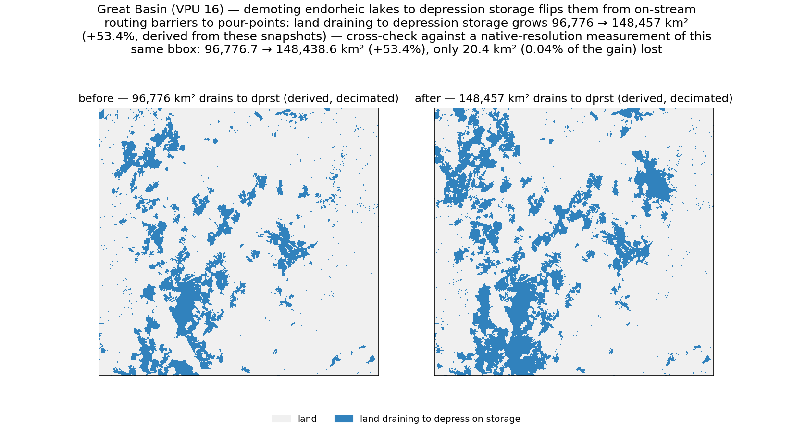

A demoted lake stops being a routing <em>barrier</em> and becomes a <em>pour-point</em>. Great Basin land draining to dprst: <strong>96,777 → 148,439 km², +53.4%</strong>, only <strong>20.4 km² lost</strong> (0.04%) — the strict-subtraction invariant made visible.

---

## Validation gates

**20 named fixtures** (`scripts/diagnose/endorheic_fixtures.py`) — the waterbodies
the classifier exists to get right, and the ones a bad fix would destroy:

| Must become dprst (10) | Must stay on-stream (10) |
|---|---|
| Great Salt Lake, Salton Sea, Pyramid, Mono, Walker, Abert, Summer, Honey, Goose, Devils | the five Great Lakes, Champlain, Lake of the Woods, Lake Borgne, Everglades, Lewis and Clark |

- **20/20 pass**, with **no guard, no exception list, no tuning knob** — the
  hydrology-first rule alone. Great Salt Lake / Salton Sea / Pyramid / Mono go
  **0.0% → 100.0%** dprst; every domain exit stays at **0.0%**.
- The product-level raster A/B (`scripts/diagnose/ab_endorheic_rebuild.py`) gates on
  the **product** (`dprst_binary.tif`), not on the classifier table — so a table that
  says the right thing but does not reach the raster still fails.

---

## Not in PR #178, and open issues

**PR #178 is open and unmerged.** Two things it deliberately does *not* do:

- **The profile still points at the hand-made waterbody layer.**
  `nhd_waterbodies.parquet` is staged from source and verified, but its shoreline
  vintage differs by **2.2% in area** — repointing would shift the validated
  product, so it is a separate change.
- **`dprst_depth` (#173) must be regenerated.** It is masked to `dprst_binary`,
  which now includes Great Salt Lake and 1,658 new polygons.

| Issue | Open refinement |
|---|---|
| #154 | Managed reservoirs need their own PRMS treatment, not plain dprst |
| #155 | Permanence gate — intermittent/ephemeral waterbodies |
| #156 | ~4% of waterbodies reclassify under a clump-merge sensitivity check |
| #157 | ~0.05% cross-VPU seam artifacts |
| #147 | Depression-respecting FDR — A/B against an alternate flow grid |

---

## Summary

- **The pipeline** is open-source, reproducible, and CONUS-scale: rasterio,
  richdem/WhiteboxTools, an in-process D8 kernel, gdptools, pixi, SLURM.
- **The classifier is the product.** A waterbody is depression storage *unless
  proven on-stream* — proof being Network-gated NHD evidence, never distance.
- **The Network gate was necessary but not sufficient.** With it in place, Great
  Salt Lake still came out **0% depression storage**. The fix is **Signal A —
  terminus-inside-itself** — plus exempting endorheic cells from the clump veto:
  **+22.1% CONUS dprst**, 20/20 fixtures, no guard.
- Classifier and router **read the same FDR grid with the same D8 kernel**, so they
  cannot disagree; and every endorheic change is a **strict subtraction**.

<code>docs/0b_TB_depr_stor.py</code> (legacy) · NHDPlus V2 PlusFlowlineVAA + Sink/BurnAdd ·
<code>docs/superpowers/specs/2026-07-12-endorheic-dprst-classifier-design.md</code> ·
<code>docs/ARCHITECTURE.md</code>

