# Snow depletion curves from SNODAS

### Deriving a PRMS/NHM parameter from daily snow observations

Following Driscoll et al. (2017) and Sexstone et al. (2020)

<span class="footnote">
gfv2-params pipeline · Part 2c · Oregon (validation) + CONUS (production)
</span>

<!--
Goal of this session: explain, in plain terms, how we turn 20 years of daily
SNODAS snow observations into a small, physically-grounded set of snow depletion
curves that PRMS/pyWatershed can use — and show real results for Oregon.
-->

---

## What is a snow depletion curve?

As a snowpack melts, the snow does **not** disappear evenly. Deep drifts and
shaded slopes hold snow long after wind-scoured ridges and sunny faces go bare.

A **snow depletion curve (SDC)** answers one question:

> *As the snowpack melts down, what fraction of the area is still snow-covered?*

<div class="two">

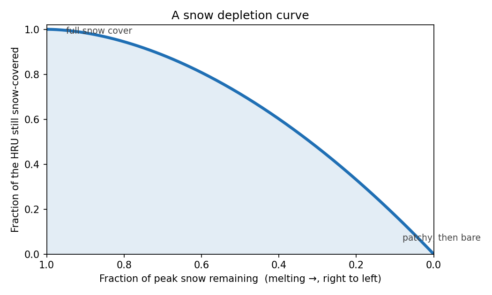

<div>

- **x-axis:** how much of the peak snow is left (melting → right to left)
- **y-axis:** fraction of the area still under snow
- Full cover at peak → patchy → bare

</div>
</div>

<!--
Define the two axes carefully — this curve shape is the whole subject of the talk.
"Snow-covered area" (SCA) is the fraction of the ground under snow, 0 to 1.
-->

---

## Why PRMS needs it

Snow-covered area controls the surface **energy balance**:

- Snow is bright (high albedo) → reflects sunlight → slow melt
- Bare ground is dark → absorbs sunlight → fast melt

So the **rate** of snowmelt — and the **timing** of snowmelt-driven streamflow —
depends on how quickly the snow-covered area shrinks as the pack melts.

<div class="callout">
Two HRUs with the same <em>average</em> snow can melt out very differently
depending on how <em>evenly</em> the snow is spread. Capturing that is the goal.
</div>

<!--
HRU = Hydrologic Response Unit, the model's spatial building block (a polygon).
PRMS applies one depletion curve per HRU to convert modeled snowpack into
snow-covered area each day. Historically these curves were generic; we can do
better using observations.
-->

---

## Two papers shaped this work

**Driscoll, Hay & Bock (2017)** — *derive the curve from observations.*
For each HRU and each melt season, follow the snowpack from peak to snow-free in
the SNODAS record and read off the snow-covered-area-vs-snow curve.
→ shapes **Stage 1 & 2**.

**Sexstone, Driscoll, Hay, Hammond & Barnhart (2020)** — *make it compact and
physical.* A curve's shape is set mainly by the **sub-grid variability** of snow;
a small **library** of curves indexed by that variability represents every HRU.
→ shapes **Stage 3**.

<span class="footnote">
Driscoll et al. 2017, <em>JAWRA</em>. · Sexstone et al. 2020, <em>Hydrological Processes</em> 34:2365–2380.
</span>

---

## The data: SNODAS

**SNODAS** (NOAA's Snow Data Assimilation System) — a daily, ~1 km modeled grid
of **snow water equivalent (SWE)** across the continental U.S.

- **SWE** = the depth of water you'd get if the snow melted (mm). The standard
  measure of "how much snow."
- We use **21 water years** (2004–2024). A **water year** runs Oct 1 → Sep 30,
  so it keeps a whole snow season in one bucket.

<div class="callout">
The workflow is <strong>fabric-independent</strong>: SNODAS is aggregated to
whatever HRU polygons the model fabric provides.
</div>

---

## The pipeline at a glance

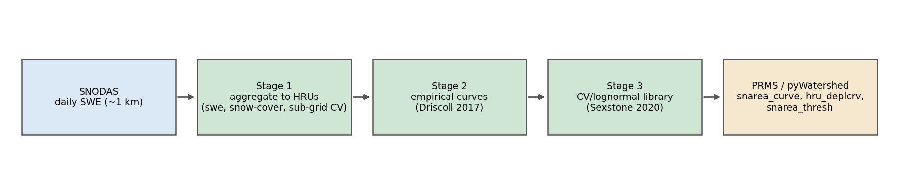

- **Stage 1** — average SNODAS onto each HRU (daily snow + snow-cover + spread)
- **Stage 2** — extract an empirical depletion curve per HRU (Driscoll)
- **Stage 3** — compress those into a small CV-indexed library (Sexstone)
- **Output** — three PRMS/pyWatershed parameters

<!--
One command submits all of this as chained SLURM jobs; the last slide covers that.
Everything between here and there is what happens inside these boxes.
-->

---

## Stage 1 — aggregate SNODAS to HRUs

For every HRU and every day we area-average the SNODAS cells inside it to get:
**mean SWE**, **snow-covered fraction** (share of cells with snow), and the
**sub-grid spread** of SWE (used in Stage 3).

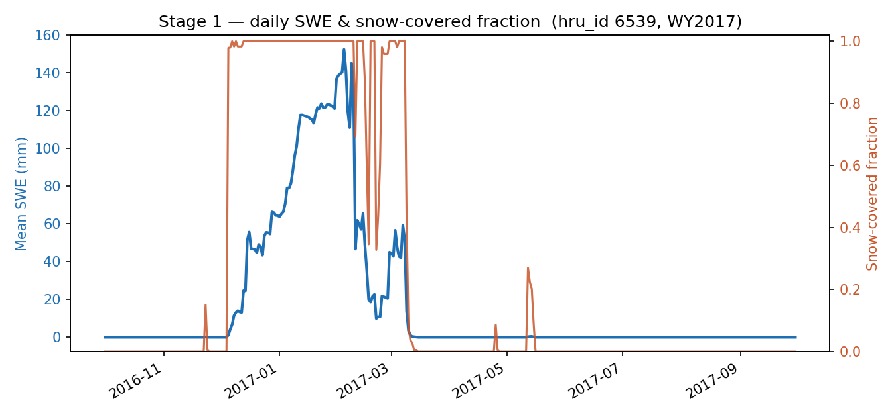

<div class="caption">
One Oregon HRU, one water year: snow builds through winter, peaks, then melts out
— snow-covered fraction stays near 1 until the melt, then falls to 0.
</div>

---

## Stage 2 — extract the melt season (Driscoll)

From peak SWE to the first snow-free day, keep only the **melt limb** and remove
short **snowfall reversals** (spring storms that briefly re-cover the ground), so
we see the idealized melt-out.

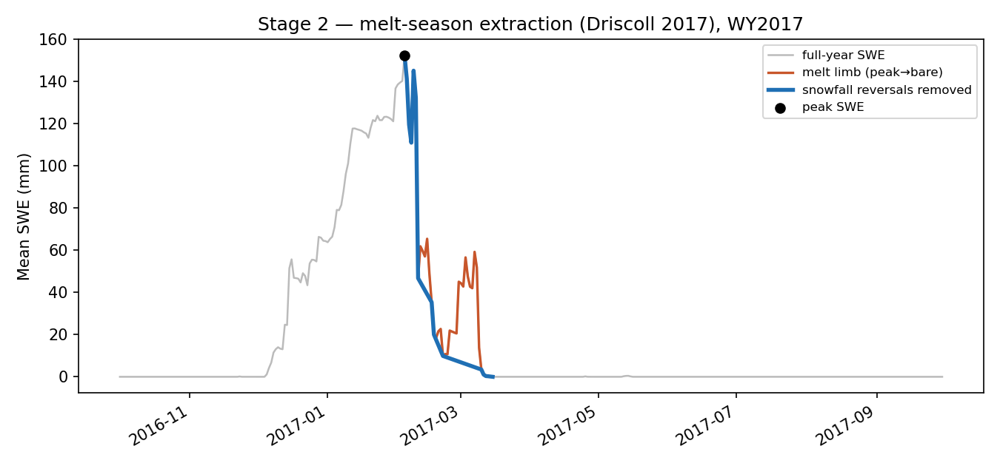

<div class="caption">
Grey = full year · orange = raw melt limb · blue = after removing snowfall
reversals · ● = peak SWE.
</div>

---

## Stage 2 — a representative curve across years

Each melt season gives one curve; the HRU's **representative curve** is the
point-by-point **median** across all its seasons. A **similarity** score measures
how consistent the seasons are (lower = more consistent).

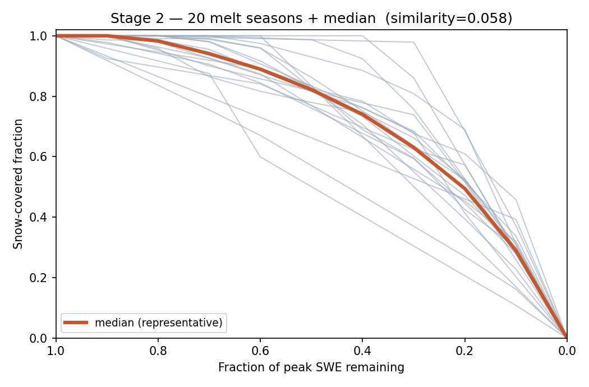

<div class="caption">
One Oregon HRU: 20 seasons (grey) and their median (orange).
</div>

---

## Stage 2 — when do we trust a derived curve?

An HRU only gets a derived curve if its melt record is trustworthy. Otherwise it
falls back to a default. The gates (plain English):

| Gate | Meaning |
|---|---|
| enough cells | HRU covers enough SNODAS cells to be meaningful |
| not mostly water | lakes/ocean don't dominate the HRU |
| real seasonal snow | it actually accumulates and melts each year |
| not constant | snow-covered area genuinely changes (not flat) |
| consistent years | seasons agree with each other (low dissimilarity) |

<!--
First failing gate names the fallback reason — that's the sdc_status field on the
next slide's coverage chart.
-->

---

## Stage 3 — the key idea (Sexstone)

The **shape** of a depletion curve is set by how **unevenly** snow is distributed
within the HRU — its **coefficient of variation (CV)** = spread ÷ mean of SWE.

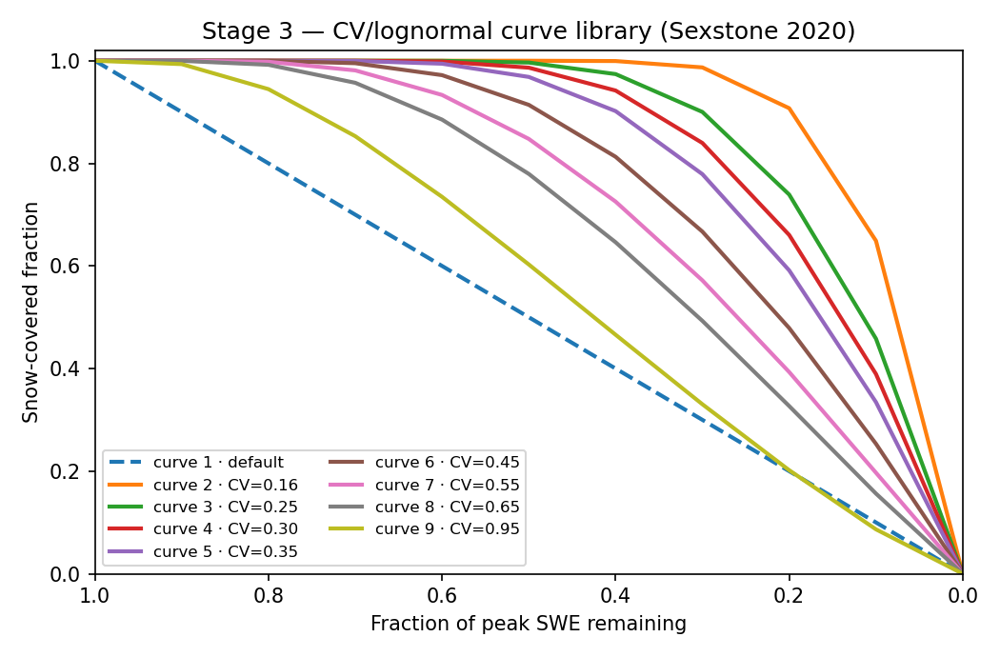

<div class="caption">
Low CV (even snow) → stays fully covered, then drops fast. High CV (patchy snow)
→ bare patches appear early, gradual decline. One CV → one curve.
</div>

---

## Stage 3 — a lognormal library, calibrated

Sub-grid SWE is well-described by a **lognormal** distribution, which turns a CV
into a curve analytically. We **calibrate** the sub-grid CV so its curves match
the empirical ones, then check the fit.

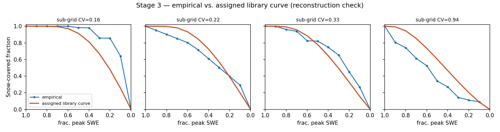

<div class="caption">
Sample Oregon HRUs: empirical curve (blue) vs. the assigned library curve (orange)
after calibration. Mean reconstruction error ≈ 0.06 snow-covered-area units.
</div>

---

## Stage 3 — from many curves to a few

We don't store a unique curve per HRU. We bin HRUs into **8 equal-population CV
groups** (+ 1 reserved default) = a **9-curve library**, and give each HRU an
**index** to its nearest curve.

<div class="callout">
Thousands of empirical curves → <strong>9 shared curves + one index per HRU</strong>.
Compact, physical, and easy for the model to consume. This compression is the
Sexstone contribution.
</div>

Oregon library CVs: 0.16, 0.25, 0.30, 0.35, 0.45, 0.55, 0.65, 0.95 (+ default).

---

## Results — Oregon (validation fabric)

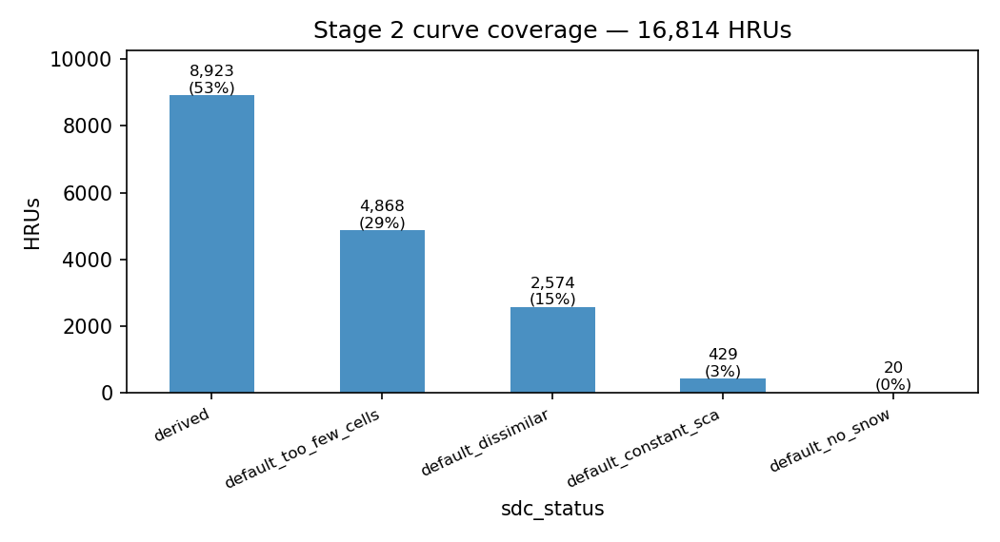

- **16,814 HRUs** · **53% got a derived curve**; the rest fall back (mostly
  "too few cells" — Oregon's HRUs are small and elevation-banded).
- Calibration moved median CV 0.19 → 0.45 and **halved** reconstruction error.

<!--
Coverage is honest: fine, elevation-banded HRUs often cover too few 1-km SNODAS
cells. CONUS HRUs are larger, so the derived fraction is expected to be higher.
-->

---

## Results — spatial pattern

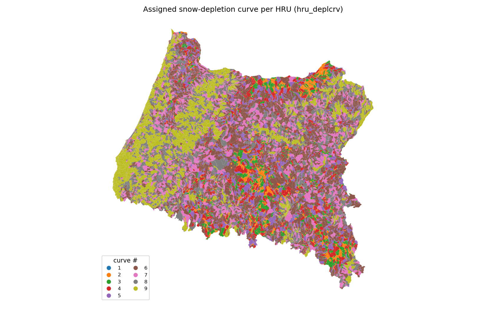

<div class="caption">
Each Oregon HRU colored by its assigned curve. The pattern is spatially coherent
— low-elevation west (patchy, high-CV curves) differs from the interior.
CONUS/gfv2 map to follow from the production run.
</div>

---

## Products — what pyWatershed consumes

All three land in `nhm_snarea_curve.nc`:

| Parameter | Shape | Meaning |
|---|---|---|
| `snarea_curve` | ndepl × 11 | the **library** (9 curves × 11 points) |
| `hru_deplcrv` | per HRU | **index** into the library for each HRU |
| `snarea_thresh` | per HRU | SWE above which the HRU is 100% covered |

<div class="callout">
The per-HRU <em>empirical</em> curve (Stage 2) is a diagnostic — pyWatershed does
<strong>not</strong> take one curve per HRU. It takes the shared library + index.
</div>

---

## How it runs

One command submits the whole pipeline as four chained SLURM jobs:

```bash
./slurm_batch/submit_snarea_pipeline.sh <fabric>
```

**aggregate** (per-batch array) → **merge** → **Stage 2 curves** → **Stage 3 library**

Each job waits for the previous (`afterok`), so a failure stops the chain cleanly
— no mixing of old and new outputs.

<!--
Batches: Oregon=2, CONUS=64. Stage 1 is the heavy step; Stage 2/3 read its
aggregated NetCDFs. Details in slurm_batch/RUNME.md Step 8.
-->

---

## Summary

- Snow depletion curves tell PRMS **how snow-covered area shrinks as snow melts**
  — a control on snowmelt timing.
- We **derive** them from 20+ years of daily SNODAS (Driscoll), then **compress**
  them into a **9-curve, CV-indexed library** (Sexstone) — compact and physical.
- Delivered as three pyWatershed parameters, fabric-independent, one command to run.

<span class="footnote">
References: Driscoll, Hay & Bock (2017), <em>JAWRA</em> · Sexstone et al. (2020),
<em>Hydrological Processes</em> 34:2365–2380.
Repo: <code>docs/ARCHITECTURE.md</code> (Part 2c) · <code>slurm_batch/RUNME.md</code> (Step 8).
</span>

---

# Backup

---

## Backup — how many curves, and why 9?

We split the calibrated sub-grid CV into **8 equal-population bins**; each bin's
**median CV** becomes one library curve (+ 1 reserved default = 9).

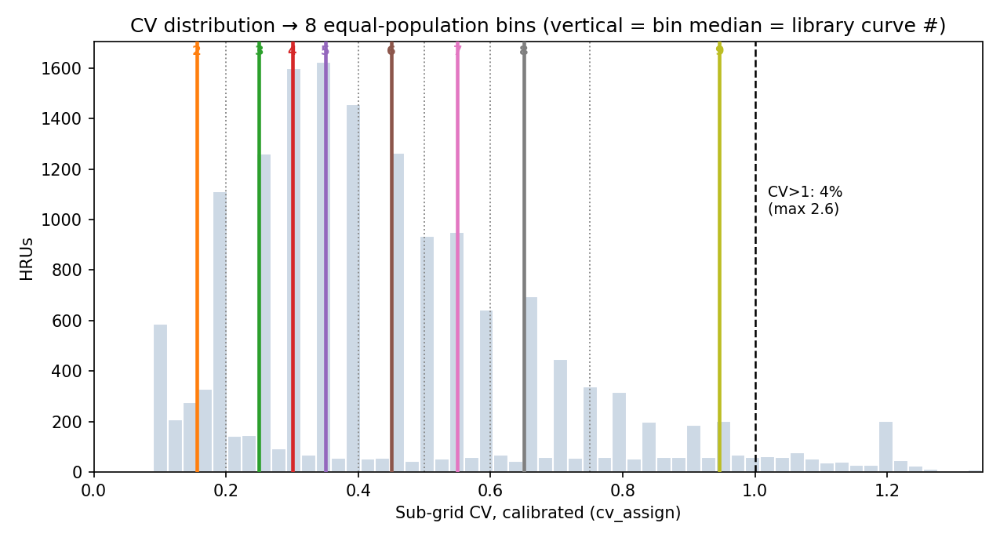

- Bins are narrow where HRUs cluster (low CV), wide in the sparse tail.
- **pyWatershed does not cap the number of curves** — `ndepl` is a free dimension
  (`hru_deplcrv` need only be ≤ `ndepl`). 9 is our `ndepl_cv` choice, not a limit.
  More curves (or a dedicated tail bin) is a one-config change.

---

## Backup — the high-CV tail

The lognormal curve only dips **below** the linear default for **CV > ~1** (steep
early snow-cover loss when snow is very patchy). At the library's top CV (0.95)
it sits essentially on the default.

<div class="two">

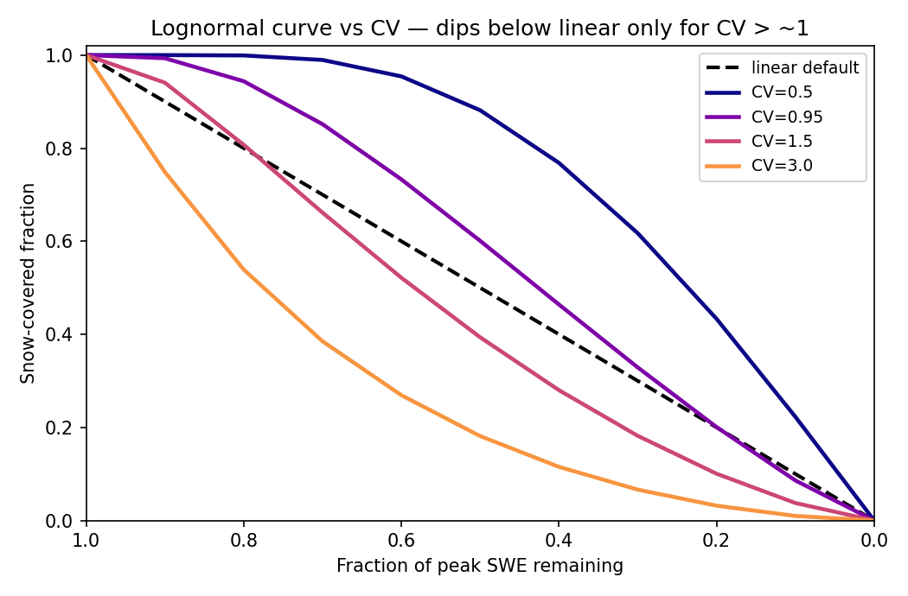

<div>

- Only **~4–5%** of Oregon HRUs have CV > 1 (max ≈ 2.6).
- Equal-population binning gives the top bin a median of 0.95, so those HRUs are
  assigned curve 9 — a **milder** curve than their real melt-out.
- That's the empirical-below-library gap seen on the CV≈0.94 reconstruction panel.

</div>
</div>

<span class="footnote">
Lever if the tail matters: raise <code>ndepl_cv</code> or add a dedicated high-CV bin.
</span>
